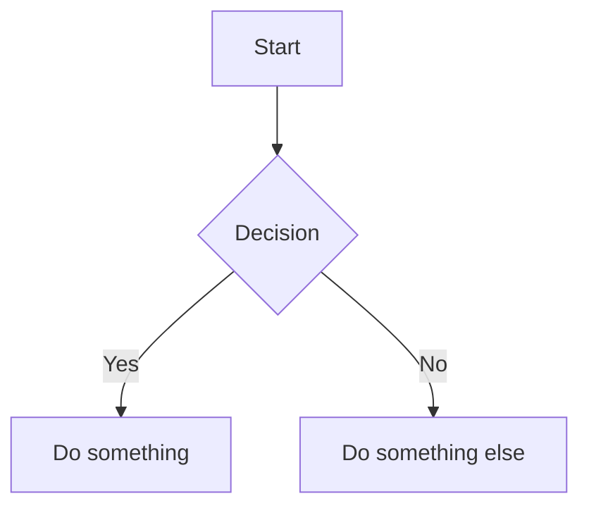

# Add Code Sample

Add code snippets and external code files to blog posts.

## Inline Code Blocks

Use fenced code blocks with language identifier for syntax highlighting:

~~~markdown
```fsharp
let add x y = x + y
let result = add 1 2
```
~~~

### Supported Languages

Common languages with Rouge syntax highlighting:
- `fsharp` / `fs` - F#
- `csharp` / `cs` - C#
- `python` - Python
- `javascript` / `js` - JavaScript
- `typescript` / `ts` - TypeScript
- `bash` / `shell` - Shell scripts
- `powershell` - PowerShell
- `json` - JSON
- `yaml` - YAML
- `sql` - SQL
- `haskell` - Haskell

## External Code Files

For longer code samples, store them in the `code/` directory:

```
code/YYYY-MM-DD/filename.ext
```

Example: `code/2025-11-26/lambda-calculus.fsx`

### Reference Pattern

You can either:

1. **Link to the file**:
   ```markdown
   See the full source: [lambda-calculus.fsx](/code/2025-11-26/lambda-calculus.fsx)
   ```

2. **Include key excerpts** in the post with syntax highlighting

## Code Block Options

### With Line Numbers (if theme supports)
Some themes support line numbers via Liquid:
```liquid

let x = 1
let y = 2

```

### With Title/Caption
```html
<figcaption>Example: Simple addition function</figcaption>

```fsharp
let add x y = x + y
```
```

## Math Equations

The blog supports MathJax for mathematical notation:

**Inline math**: `$E = mc^2$`

**Block math**:
```markdown
$$
\sum_{i=1}^{n} i = \frac{n(n+1)}{2}
$$
```

## Mermaid Diagrams

The blog supports Mermaid.js diagrams:

~~~markdown

~~~

## Example Post with Code

```markdown
---
    layout: post
    title: "F# Pattern Matching"
    tags: [F#, functional-programming]
    author: johnazariah
    summary: Exploring pattern matching in F#.
---

### Basic Pattern Matching

Here's a simple example:

```fsharp
let describe x =
    match x with
    | 0 -> "zero"
    | 1 -> "one"
    | _ -> "many"
```

The function uses pattern matching to return different strings based on the input value.
```
