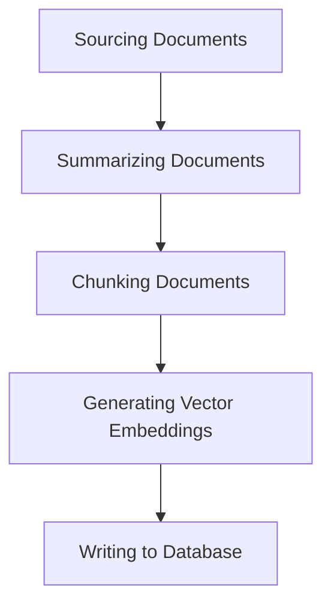

# Sinuous Strongly-Typed Python Pipelines

## Executive Summary

This blog explores the design and implementation of strongly-typed, composable pipelines in Python. By using type safety and modularity, pipelines can be constructed with clear input-output contracts between stages, reducing runtime errors and improving maintainability. The post introduces tools like `TypeAnnotatedMeta` for runtime type validation and demonstrates how pipelines, as well as individual stages, can act as "fat" functions to encapsulate state and behavior while remaining composable. Examples are provided to showcase real-world applications of these principles, emphasizing flexibility, clarity, and ease of reasoning in complex workflows.

The code referred to in this blog post can be found at [Python Pipelines](https://github.com/johnazariah/python-pipelines).

## Introduction

Building a sequence of operations, where each stage has its own distinct concern, is a common problem in software engineering. Whether you are processing data, orchestrating tasks, or transforming information, achieving a clean separation of concerns and maintaining clarity of composition is paramount. A type-safe approach to pipelines ensures that each stage connects seamlessly to the next, reducing errors and improving maintainability.

This post explores how to design such pipelines in Python, emphasizing type safety and composability.

## Example: Indexing Documents for a RAG Database

Consider the task of indexing a set of documents for a Retrieval-Augmented Generation (RAG) database. This involves multiple distinct stages, each with its own set of responsibilities:

1. **Sourcing Documents**: Fetch documents from a GitHub repository (handling authentication and file transfer).

1. **Summarizing Documents**: Use a summarizer (e.g., ChatGPT) to condense document content.

1. **Chunking Documents**: Split documents into manageable chunks using libraries like OpenAI’s tokenizer.

1. **Generating Vector Embeddings**: Use an embedding model (e.g., OpenAI) to compute vector representations for each chunk.

1. **Writing to Database**: Store the embeddings in a database (handling database authentication and storage).



### Why Bother With Pipelines?

In many implementations, all these concerns are conflated into a single script with perhaps proper encapsulation into functions. While this sounds simple and sensible, this approach really leads to:

* Reduced Clarity: The overall process becomes opaque, and testing or debugging individual stages becomes difficult.

* Inflexibility: Replacing or reusing stages in other workflows becomes cumbersome. Furthermore, as we will discuss in future posts, composition of stages can involve more complex operations, and writing these as discrete, composable pieces will allow us to modify how we compose them going forward. 

A composable pipeline addresses these issues by isolating each stage into its own unit, which could be tested independently. Each stage has a clear input-output contract, making the overall process modular and easier to understand. By chaining these stages together, we create a clean and cohesive pipeline - and furthermore, we could control* how* the stages are chained together to get significantly more flexibility.

## Type Safety in Python Pipelines

One of the key advantages of composable pipelines is the ability to enforce type safety. When each stage’s output matches the next stage’s input, we reduce runtime errors and increase confidence in our workflows.

### The Apparent Weakness (and True Strength) of Python
Unlike strongly-typed languages, Python does not enforce type safety at runtime. 

We can try to use type hints (`Generic`, `TypeVar`, etc.) to define input-output contracts, but these are type _hints_ to the linter, and not really enforced - or indeed normally accessible - at runtime. But we want to validate that these type annotations align so that we have some guarantees the stages in the pipeline are compatible.

The `generics` package addresses these challenges by introducing the `TypeAnnotatedMeta` metaclass. This metaclass captures the type hints provided for a class at the time of definition (and specialization), and makes them available as part of the class structure, so we can use them for runtime validation.

In parallel, the pipeline package introduces the `Pipeline` object, which takes a sequence of stages and ensures that their types line up correctly. Since we provide the `TypeAnnotatedMeta` metaclass to the `PipelineStage` and `Pipeline` objects, we have access to the specific type specializations of each stage, and when constructing pipeline, we can validate both that the output type of each stage matches the input type of the subsequent stage, and that the input and output types of the respective terminal stages match those of the `Pipeline`. 

The class definition and validation logic are shown below:

```python

class Pipeline(Generic[TPipelineInput, TPipelineResult], metaclass=TypeAnnotatedMeta):
    def __init__(self, stages: Iterable[PipelineStage[Any, Any]] = None):
        """Validates that the stages passed in are compatible with each other and with the expected input and output types."""
        self.stages = self._validate_stages(list(stages or [IdentityStage[self.TPipelineInput, self.TPipelineInput]()]))

    def _validate_stages(
        self, stages_list: list[PipelineStage[Any, Any]]
    ) -> list[PipelineStage[Any, Any]]:
        if not stages_list:
            raise ValueError("PipelineBase must have at least one stage.")

        def validate_type(expected_input_type, stage):
            if expected_input_type != stage.TStageInput:
                raise TypeError(
                    f"Input type of {stage} ({stage.TStageInput}) does not match {expected_input_type}."
                )
            return stage.TStageResult

        if self.TPipelineResult != reduce(validate_type, stages_list, self.TPipelineInput):
            raise TypeError(
                f"Output type of the last stage ({stages_list[-1].TStageResult}) does not match {self.TPipelineResult}."
            )

        return stages_list
```

The `self.TPipelineInput` and `self.TPipelineResult` expressions refer to the *values* of the `Pipeline`'s type parameter annotations. Similarly, `stage.TStageInput` and `stage.TStageResult` refer to the input and output types of each individual stage, *which are the actual values bound to the type arguments when the stage was defined*.

This is precisely `what the TypeAnnotatedMeta` metaclass makes possible. Notice that the `Pipeline` will not be created if the types don't line up, so it won't be possible to create and execute a type-mismatched sequence of stages.

### _A Parenthetical Aside About Strongly-Typed Languages_
_Most strongly-typed languages enforce type safety at compile time, which can feel like having a safety net while working on high-wire code. However, these languages often struggle with representing pipelines with an arbitrary number of stages because the stage types would need to be explicitly enumerated. This rigidity limits their flexibility when working with dynamic workflows.

To address this, advanced type systems in some strongly-typed languages introduce constructs like **existential types** - which abstract over unknown types within specific constraints, enabling flexibility while maintaining type safety. Most common languages do not support existential types, so one must resort to runtime-reflection or some similar approach to achieve type-safety at runtime. 

This is an example where using Python over, say C#, actually simplifies this approach and achieves a comparable degree of runtime type-safety._

## Python's "Fat" Functions: Encapsulating Context for Chained Stages

In Python, a common approach to implementing composable pipelines involves treating classes with encapsulated context as "fat" functions. These classes encapsulate all the state and behavior required for a specific stage, but from the perspective of the pipeline, they act like simple functions. This design enables seamless chaining of stages while preserving clarity and separation of concerns.

### The Concept
A "fat" function is essentially a class that:

* Holds all the context and configuration needed for its operation.
* Implements a __call__ method, allowing the class instance to be invoked like a function.

This approach provides the benefits of both worlds:

* The simplicity and composability of functions.
* The encapsulation and reusability of classes.

### Using "Fat" Functions in a Pipeline

```python
from dataclasses import dataclass, field
from typing import Callable, List
from pipeline.pipeline.pipeline import PipelineStage, Pipeline

@dataclass
class InitialStage(PipelineStage[int, int]):
    @classmethod
    def double(cls, x: int) -> list[int]:
        return [2 * x]

    def __init__(self):
        self.transform = self.double


@dataclass
class IntermediateStage(PipelineStage[int, str]):
    def tostring(self, x: int) -> list[str]:
        return [str(x)]

    def __init__(self):
        self.transform = self.tostring


@dataclass
class FinalStage(PipelineStage[str, str]):
    transform: Callable[[str], list[str]] = field(default_factory=lambda: lambda x: [x.upper()])

# Creating a pipeline with some stages
pipeline = Pipeline[int, str]([InitialStage(), IntermediateStage(), FinalStage()])

# Running the pipeline
result = pipeline(5)  # Expected output: ["10"]
print(result)
```

You'll note that the `Pipeline` itself acts as a "fat" function, making it executable just like any other function. 

### Advantages

* **Encapsulation**: Each stage is self-contained, making it easier to manage and test.

* **Composability**: Stages can be chained together like functions, promoting clarity.

* **Flexibility**: Context-specific configuration is encapsulated within each stage, reducing the need for global state.

By leveraging "fat" functions, Python pipelines achieve a balance between modularity and simplicity, enabling developers to focus on the flow of data without sacrificing maintainability.

We'll see in coming blog posts how we can gain further flexibility by controlling how stages compose!

## Conclusion
This post has explored how strongly-typed Python pipelines combine the benefits of type safety, modularity, and composability to create robust and maintainable workflows. We began with the challenges of managing multi-stage processes and demonstrated how tools like `TypeAnnotatedMeta` and the `pipeline` package help enforce type safety at runtime.

Using "fat" functions, both at the stage level and the pipeline level, further simplifies chaining and execution while maintaining clarity and separation of concerns, whilst giving a familiar, easy-to-read flow of code.

By adopting these principles and tools, you can build pipelines that are not only functional but also elegant, easy to reason about, and easy to maintain.

