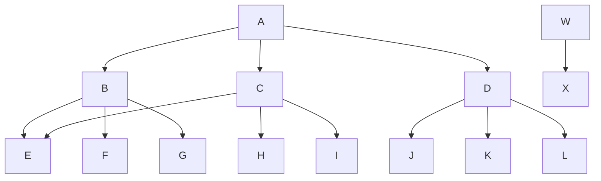

_Dedicated to [Prof Neeldhara Misra](https://www.neeldhara.com/), who invited me to give a version of this talk to her class at IIT Gandhinagar._

---

> *One loop to traverse them all, and in the structure bind them.*

---

## Introduction: Graphs Are Everywhere

Graphs are an enormously useful data structure. They allow us to represent networks, dependencies, relationships, and many other real-world concepts with remarkable elegance. Some relatively common applications of graph traversals include:

- **Real-time navigation** optimizing for distance or time
- **Spreadsheet recomputation** when a cell value changes
- **Project scheduling** respecting resource constraints
- **Circuit board layout** minimizing trace crossings
- **Pandemic contact tracing**
- ...and many, many more.

The two simplest algorithms for graph traversal are **Breadth-First Traversal (BFT)** and **Depth-First Traversal (DFT)**. Every computer science student learns them. Every textbook presents them. And virtually every textbook presents them as *two different algorithms*.

Conceptually, they are not.

In this post, I want to show you something beautiful: BFT and DFT are the *same algorithm*. The only difference is a single policy decision about how we manage our "to-do list" of vertices to visit. Once you see this, you'll never unsee it—and you'll realize that Dijkstra's algorithm and A* are just variations on the same theme.

## A Sample Graph

Let's work with a concrete example. Consider this directed graph:



We have two "roots" (vertices with no incoming edges): `A` and `W`. Our goal is to visit every vertex reachable from these roots.

## Breadth-First Traversal

BFT explores the graph level by level. Starting from a root, we visit all vertices at distance 1, then all vertices at distance 2, and so on. It's like ripples spreading out from a stone dropped in a pond.

**Applications:**
- Finding the shortest path in an unweighted graph
- Social network "degrees of separation"
- Web crawlers exploring links
- Level-order traversal of trees

Here's a clean Python implementation using `collections.deque`:

```python
from collections import deque

def bft(graph, roots):
    visited = set()
    result = []
    queue = deque()
    
    for root in roots:
        queue.append(root)
        visited.add(root)
    
    while queue:
        vertex = queue.popleft()
        result.append(vertex)
        
        for neighbour in graph.neighbours(vertex):
            if neighbour not in visited:
                visited.add(neighbour)
                queue.append(neighbour)
    
    return result
```

Running this on our sample graph starting from roots `{A, W}`:

```
['A', 'W', 'B', 'C', 'D', 'X', 'E', 'F', 'G', 'H', 'I', 'J', 'K', 'L']
```

Notice how we visit `B`, `C`, `D` (distance 1 from `A`) before `E`, `F`, `G` (distance 2).

> **Sidebar: Why `deque`?**
>
> In Python, using `list.pop(0)` is O(n) because it shifts all remaining elements. The `deque` (double-ended queue) gives us O(1) `popleft()` and `append()`. For a graph with 100 nodes, nobody cares. For 100,000 nodes, your code will time out. Don't build bad habits.

## Depth-First Traversal

DFT explores as far as possible along each branch before backtracking. It's like exploring a maze by always taking the first unexplored corridor until you hit a dead end, then backtracking.

**Applications:**
- Topological sorting
- Cycle detection
- Maze solving
- Dependency resolution
- Finding connected components

Here's the implementation:

```python
from collections import deque

def dft(graph, roots):
    visited = set()
    result = []
    stack = deque()
    
    for root in roots:
        stack.appendleft(root)
        visited.add(root)
    
    while stack:
        vertex = stack.popleft()
        result.append(vertex)
        
        for neighbour in graph.neighbours(vertex):
            if neighbour not in visited:
                visited.add(neighbour)
                stack.appendleft(neighbour)
    
    return result
```

Running this on the same graph:

```
['W', 'X', 'A', 'D', 'L', 'K', 'J', 'C', 'I', 'H', 'E', 'B', 'G', 'F']
```

Now we go deep: `A` → `D` → `L`, then backtrack to `K`, then `J`, and so on.

> **A Small Note on Ordering**
>
> Iterative DFS processes neighbours in reverse order compared to recursive DFS. When we `appendleft` neighbours `[B, C, D]`, we pop `D` first. Recursive DFS would visit `B` first. For traversal purposes this rarely matters, but if you need identical ordering, reverse the neighbour list before pushing.

## The Textbook Lie

At this point, you've seen two algorithms. You've probably been taught them as two separate things to memorize, with different properties and different use cases.

But look at the code again.

Here they are, side by side:

| BFT | DFT |
|-----|-----|
| `queue.append(root)` | `stack.appendleft(root)` |
| `vertex = queue.popleft()` | `vertex = stack.popleft()` |
| `queue.append(neighbour)` | `stack.appendleft(neighbour)` |

That's it. That's the *entire* difference.

- BFT uses the container as a **queue**: add to the back, remove from the front (FIFO).
- DFT uses the container as a **stack**: add to the front, remove from the front (LIFO).

The algorithm is identical. The *policy* for managing the worklist is the variable.

## One Loop to Traverse Them All

Once we see this, we can unify the code. Let's extract the common structure and parameterize the insertion policy:

```python
from collections import deque

def traverse(graph, roots, insert):
    visited = set()
    result = []
    bag = deque()
    
    for root in roots:
        insert(bag, root)
        visited.add(root)
    
    while bag:
        vertex = bag.popleft()
        result.append(vertex)
        
        for neighbour in graph.neighbours(vertex):
            if neighbour not in visited:
                visited.add(neighbour)
                insert(bag, neighbour)
    
    return result

def bft(graph, roots):
    return traverse(graph, roots, lambda bag, v: bag.append(v))

def dft(graph, roots):
    return traverse(graph, roots, lambda bag, v: bag.appendleft(v))
```

Look at that. One loop. One algorithm. The only thing that changes is a lambda.

This is the beauty of abstraction: we've identified the *essence* of graph traversal and separated it from the *policy* of vertex selection.

> **The Anti-Pattern**
>
> You might be tempted to unify the code with a boolean flag:
>
> ```python
> def traverse(graph, roots, depth_first=False):
>     ...
>     if depth_first:
>         bag.appendleft(neighbour)
>     else:
>         bag.append(neighbour)
> ```
>
> Don't do this. It leads to `if` statements scattered throughout your code, makes extension harder, and violates the Open/Closed Principle. Injecting the behaviour as a function is cleaner, more extensible, and frankly, more elegant.

## The Frontier Expands: Dijkstra and A*

Now here's where it gets really interesting.

We've seen that:
- **Stack (LIFO)** → Explore the *deepest* vertex → **DFS**
- **Queue (FIFO)** → Explore the *nearest* vertex → **BFS**

What if we don't want "deepest" or "nearest"? What if we want *cheapest*?

Enter the **priority queue**.

In fact, BFS is just a special case of Dijkstra's algorithm where every edge has cost 1. The priority queue degenerates into a simple FIFO queue, and the algorithm becomes breadth-first traversal.

If we replace our bag with a priority queue ordered by cumulative edge cost, we get **Dijkstra's algorithm**—the classic shortest-path algorithm for weighted graphs.

If we order by cumulative cost *plus a heuristic estimate* of remaining distance, we get **A***—the algorithm that powers game pathfinding and GPS navigation.

| Bag | Selection Policy | Algorithm |
|-----|------------------|-----------|
| Stack | LIFO (deepest) | DFS |
| Queue | FIFO (nearest by hops) | BFS |
| Priority Queue (cut edge weight) | Minimum crossing edge | Prim's MST |
| Priority Queue (path cost) | Minimum cumulative cost | Dijkstra |
| Priority Queue (cost + heuristic) | Minimum $f(n) = g(n) + h(n)$ | A* |

**This is the profound insight: 80% of graph theory is just managing the frontier.**

The "algorithm" is always the same loop:

1. Initialize the bag with starting vertices
2. While the bag is not empty:
   - Remove a vertex according to some policy
   - Process it
   - Add its unvisited neighbours to the bag
3. Done

Everything else—DFS, BFS, Dijkstra, A*, Prim's MST, even some topological sorts—is just a choice of bag and insertion policy.

## Hardening the Contract: Types as Documentation

In Python, we pass a lambda and trust the caller to provide the right function. This works, but there's no enforcement. What if someone passes a function with the wrong signature? Runtime error.

In a language with a richer type system, we can do better. We can make the *bag interface* explicit.

Here's the same abstraction in F# using Statically Resolved Type Parameters (SRTPs):

```fsharp
let inline traverse<^V, ^W, ^B
    when ^V : comparison 
    and ^W : comparison
    and ^B : (new : unit -> ^B)
    and ^B : (member Init : Set<^V> -> ^B)
    and ^B : (member IsEmpty : bool)
    and ^B : (member Next : ^V)
    and ^B : (member Add : Set<^V> -> ^B)> 
    (graph: Graph<^V, ^W>) : ^V seq =
        let bag = (new ^B()).Init(graph.Roots)
        
        [
            while (not bag.IsEmpty) do
                let next = bag.Next
                let neighbours = graph.Neighbours next
                bag.Add neighbours |> ignore
                yield next
        ]
```

Those type constraints *document* the abstraction. They say: "If you want to be a bag, you must provide `Init`, `IsEmpty`, `Next`, and `Add`."

Now we implement different bags:

```fsharp
type TrackingQueue<'V when 'V : comparison>() = 
    let mutable _visited = Set.empty
    let mutable _toVisit = Queue<'V>()

    member this.Init roots = 
        roots |> Seq.iter _toVisit.Enqueue
        this

    member _.IsEmpty = _toVisit.Count = 0

    member _.Next = 
        let next = _toVisit.Dequeue()
        _visited <- Set.add next _visited
        next

    member this.Add neighbours = 
        let unvisited = Set.difference neighbours _visited
        _visited <- Set.union _visited unvisited  // Eager marking!
        unvisited |> Seq.iter _toVisit.Enqueue
        this

type TrackingStack<'V when 'V : comparison>() = 
    // Same structure, but using Stack instead of Queue
    ...
```

And the traversals become trivially simple:

```fsharp
let bft graph = traverse<_, _, TrackingQueue<_>> graph
let dft graph = traverse<_, _, TrackingStack<_>> graph
```

The types enforce the contract. The compiler checks it. No runtime surprises.

> **Bonus: Whatever-First Traversal**
>
> In the F# code, I also implemented a `TrackingSet` that uses `Set.minElement` to pick the next vertex. This gives a deterministic but essentially arbitrary ordering—I call it "Whatever-First Traversal." It's not particularly useful, but it demonstrates that the abstraction is genuinely flexible. And if you squint at `Set.minElement` and imagine it's ordering by edge weight... you're looking at the seed of Dijkstra.

## Complexity

For completeness, let's note the complexity of these algorithms.

**Time:** $O(V + E)$ where $V$ is the number of vertices and $E$ is the number of edges. We visit each vertex once and examine each edge once.

**Space:** $O(V)$ for the visited set and the bag. The bag can grow to hold all vertices in the worst case.

For Dijkstra and A*, the priority queue operations add a $\log V$ factor, giving $O((V + E) \log V)$.

## Conclusion: Seeing the Pattern

This post started with a simple observation: BFT and DFT look like different algorithms but are actually the same algorithm with different data structures.

This is not a clever trick. It's a fundamental insight about the nature of graph traversal.

The real lesson here is broader than graphs. It's about *seeing the underlying structure*. When you encounter two pieces of code that look almost identical, don't just shrug and accept the duplication. Ask: *What is the essential difference?* *Can I extract the common structure and parameterize the variation?*

In our case, the essential structure was the loop. The variation was the bag policy. Once we saw that, we could:

1. Write cleaner, more maintainable code
2. Extend to new algorithms (Dijkstra, Prim, A*) with minimal effort
3. Document the abstraction with types

This is the difference between *knowing* algorithms and *understanding* them. As a student, it might seem tempting to just memorise the algorithms as encountered. My encouragement is to lift the lid a little and look for a pattern - and maybe some parameters - because there may be some underlying structure whose beauty and elegance will make you remember a lot more than what you memorised!

Happy learning!