_This is a reprise of my [2020 post on recursion and trampolines](/2020/12/07/bouncing-around-with-recursion.html), rewritten from the ground up in Python with more diagrams, more code, and a gentler pace. If you want the F#/C# version, that post still holds up!_

For Liam Kerney. Keep Typing!

---

## Introduction: Recursion's Bad Reputation

Recursion gets a bad rap in Python. Every tutorial warns you: "Don't use recursion in production—you'll blow the stack." And they're _right_ about the symptom: Python's default recursion limit is a mere 1,000 frames. Hit it, and you get a `RecursionError`.

But they're _wrong_ about the diagnosis. The problem isn't recursion itself—it's that Python (like many languages) doesn't optimize recursive calls. The _ideas_ behind recursion are sound, elegant, and mathematically rigorous. We just need better _machinery_ to run them.

In this post, we'll build that machinery from scratch:

1. **Recursion** — why it's beautiful and what goes wrong
2. **Tail Recursion** — restructuring calls so they _could_ be optimized
3. **The Accumulator Pattern** — a mechanical trick to make functions tail-recursive
4. **Continuation-Passing Style (CPS)** — handling the cases accumulators can't
5. **Trampolines** — a runtime trick that gives us stack-safe recursion in _any_ language

By the end, you'll have a reusable `Trampoline` class and the confidence to write recursive algorithms without fear.

---

## Step 1: Recursion — Beautiful but Fragile

Let's start with a classic: finding the last element of a linked list.

```python
class Node:
    def __init__(self, data, next_node=None):
        self.data = data
        self.next = next_node

def last_element(head: Node | None):
    if head is None:
        return None
    if head.next is None:
        return head.data
    return last_element(head.next)
```

This is gorgeous. The logic maps directly to the definition:

- Empty list → `None`
- Single element → that element
- Otherwise → the last element of the tail

**But try it with 2,000 nodes:**

```python
# Build a list: 1 -> 2 -> ... -> 2000
head = Node(1)
current = head
for i in range(2, 2001):
    current.next = Node(i)
    current = current.next

last_element(head)  # 💥 RecursionError: maximum recursion depth exceeded
```

### What's Happening on the Stack?

Each call to `last_element` pushes a new frame onto the call stack. The frame sits there, waiting for the recursive call to return, even though it does _nothing_ with the result except pass it back.

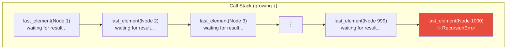

Every frame is identical in shape—it's just passing the return value through. What a waste!

---

## Step 2: Tail Recursion — The Right Shape

Notice that `last_element` is already **tail-recursive**: the recursive call is the _very last thing_ the function does. It doesn't add, multiply, or transform the result—it just returns it.

```python
def last_element(head):
    if head is None:
        return None
    if head.next is None:
        return head.data
    return last_element(head.next)  # ← tail position: nothing left to do after this
```

In languages like F#, Scheme, or Haskell, the compiler sees this pattern and replaces the recursive call with a **jump**—reusing the same stack frame. The call stack stays flat:

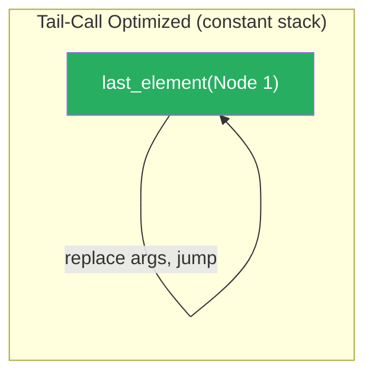

**Python doesn't do this.** Guido van Rossum has [explicitly declined](https://neopythonic.blogspot.com/2009/04/tail-recursion-elimination.html) to add tail-call optimization (TCO), citing debuggability and stack trace clarity.

So tail recursion is _necessary_ (it's the right structure) but _not sufficient_ (Python won't optimize it for us). We need to do the optimization ourselves. But first, let's learn how to make _any_ recursive function tail-recursive.

---

## Step 3: The Accumulator Pattern

Not all recursive functions start out tail-recursive. Consider computing a factorial:

$$n! = n \times (n-1) \times \cdots \times 1$$

The naïve recursive version:

```python
def factorial(n: int) -> int:
    if n <= 1:
        return 1
    return n * factorial(n - 1)  # ← NOT tail-recursive!
```

That multiplication `n * ...` happens _after_ the recursive call returns. The frame can't be reused because it still has work to do:

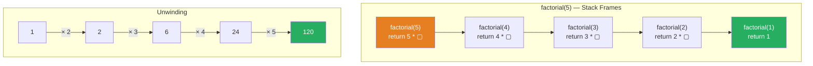

### The Fix: Carry an Accumulator

Instead of doing work _after_ the recursive call, we do the work _before_ and carry the running result as a parameter:

```python
def factorial(n: int) -> int:
    def _go(n: int, acc: int) -> int:
        if n <= 1:
            return acc
        return _go(n - 1, n * acc)  # ← tail position!
    return _go(n, 1)
```

Now the multiplication happens _before_ the recursive call, and the call is in tail position:

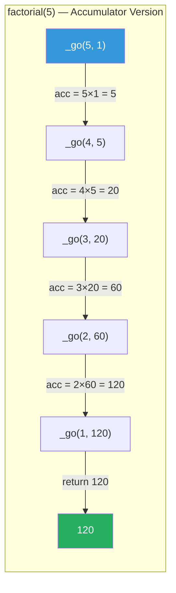

Each step is self-contained—no "unwind" phase needed. If Python optimized tail calls, this would use constant stack space.

### The Recipe

Here's the mechanical process to convert _any_ singly-recursive function with post-processing:

| Step | Action |
|------|--------|
| 1 | Add an `acc` (accumulator) parameter to the recursive helper |
| 2 | **Base case**: return `acc` instead of a fixed value |
| 3 | **Recursive case**: fold the current computation into `acc`, then recur |
| 4 | **Initial call**: pass the identity element as the starting `acc` |

Let's apply it to summing a list:

```python
# Before (not tail-recursive)
def sum_list(xs: list[int]) -> int:
    if not xs:
        return 0
    return xs[0] + sum_list(xs[1:])

# After (tail-recursive with accumulator)
def sum_list(xs: list[int]) -> int:
    def _go(xs: list[int], acc: int) -> int:
        if not xs:
            return acc
        return _go(xs[1:], xs[0] + acc)
    return _go(xs, 0)
```

This pattern works beautifully for _singly_ recursive functions. But what about functions that recur _twice_?

---

## Step 4: When Accumulators Aren't Enough

### The Fibonacci Function

$$\mathbb{F}(0) = 1, \quad \mathbb{F}(1) = 1, \quad \mathbb{F}(n) = \mathbb{F}(n-1) + \mathbb{F}(n-2)$$

```python
def fib(n: int) -> int:
    if n <= 1:
        return 1
    return fib(n - 1) + fib(n - 2)  # Two recursive calls!
```

There are _two_ calls here. At most one can be in tail position. No accumulator trick can fix this—the structure of the problem is fundamentally _doubly_ recursive.

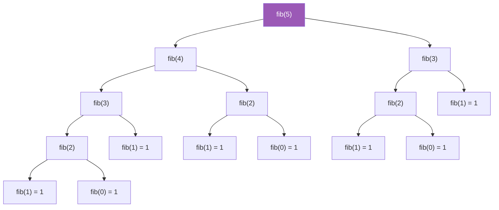

The same problem arises in **binary tree traversals**, which are doubly recursive and arise _everywhere_ in practice. The iterative versions of tree traversals are notoriously bug-prone. We need a better tool.

### Enter Continuations

A **continuation** is a function that represents "what to do next." Instead of returning a value and letting the caller process it, we _pass the caller's work_ as a function argument.

Let's start with a simple example. Consider computing `a * (b + c)`:

```python
# Normal style
def add(x, y):
    return x + y

def mul(x, y):
    return x * y

result = mul(a, add(b, c))
```

In **Continuation-Passing Style (CPS)**, each function takes an extra argument `k` — the continuation — and calls it with the result instead of returning:

```python
# CPS style
def add_k(x, y, k):
    k(x + y)

def mul_k(x, y, k):
    k(x * y)

# a * (b + c)
add_k(b, c, lambda v: mul_k(a, v, lambda result: print(result)))
```

This looks more verbose, but notice something crucial: **every function call is now in tail position**. No function ever does anything after calling another function—it just passes a continuation.

### CPS-Converting Fibonacci

Let's apply this to our doubly-recursive Fibonacci:

```python
def fib_cps(n: int, k) :
    """Fibonacci in continuation-passing style."""
    if n <= 1:
        return k(1)                                          # base: send 1 to continuation
    return fib_cps(n - 1, lambda f1:                         # compute fib(n-1), then...
               fib_cps(n - 2, lambda f2:                     # compute fib(n-2), then...
                   k(f1 + f2)))                              # send their sum to continuation

# Usage:
fib_cps(10, lambda x: x)  # returns 89
```

Let's trace through `fib_cps(3, k)` to see how continuations chain:

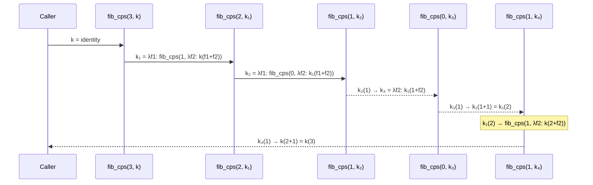

Every call is a tail call. The "stack" of pending work is encoded in the chain of closures (continuations) rather than on the actual call stack.

**But wait** — we're still making recursive _calls_. Python still pushes frames for each one. The continuations solve the _shape_ problem (everything is tail-recursive) but not the _runtime_ problem (Python still grows the stack).

We need one more piece of the puzzle.

---

## Step 5: The Trampoline — Stack Safety for Everyone

A **trampoline** is a loop that drives tail-recursive functions without growing the stack. The idea is simple:

1. Instead of making a recursive call directly, **return a description** of the call you _want_ to make.
2. A loop (the trampoline) picks up that description and executes it.
3. Repeat until we get a final value.

Since the loop replaces the recursion, the call stack never grows beyond a constant depth.

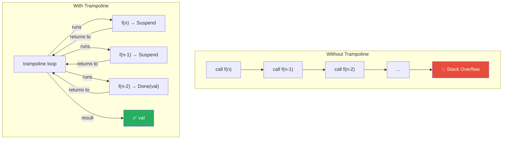

The function **bounces** back to the trampoline at each step — hence the name!

### Building the Trampoline in Python

We need two kinds of "instructions" that a function can return to the trampoline:

| Instruction | Meaning |
|-------------|---------|
| `Done(value)` | "I'm finished — here's the result" |
| `Bounce(thunk)` | "I'm not done — call this thunk to continue" |

And for chaining computations (needed for CPS/doubly-recursive functions):

| Instruction | Meaning |
|-------------|---------|
| `FlatMap(trampoline, f)` | "Run this trampoline, then feed the result to `f`" |

Here's the implementation:

```python
from __future__ import annotations
from dataclasses import dataclass
from typing import TypeVar, Generic, Callable

A = TypeVar('A')

class Trampoline(Generic[A]):
    """Base class for stack-safe recursive computations."""

    def flat_map(self, f: Callable[[A], Trampoline[A]]) -> Trampoline[A]:
        """Chain a computation: run self, then feed result to f."""
        return FlatMap(self, f)

    def map(self, f: Callable[[A], A]) -> Trampoline[A]:
        """Transform the result: run self, then apply f."""
        return FlatMap(self, lambda a: Done(f(a)))

    @staticmethod
    def run(trampoline: Trampoline[A]) -> A:
        """Execute a trampolined computation with constant stack space."""
        current = trampoline
        while True:
            match current:
                case Done(value):
                    return value
                case Bounce(thunk):
                    current = thunk()
                case FlatMap(m, f):
                    match m:
                        case Done(value):
                            current = f(value)
                        case Bounce(thunk):
                            current = FlatMap(thunk(), f)
                        case FlatMap(m2, g):
                            # Associativity: FlatMap(FlatMap(m2, g), f)
                            #             == FlatMap(m2, λa. FlatMap(g(a), f))
                            current = FlatMap(m2, lambda a, g=g, f=f: FlatMap(g(a), f))


@dataclass
class Done(Trampoline[A]):
    """Computation is complete with this value."""
    value: A

@dataclass
class Bounce(Trampoline[A]):
    """One more step to go — call thunk() to continue."""
    thunk: Callable[[], Trampoline[A]]

@dataclass
class FlatMap(Trampoline[A]):
    """Run m, then feed its result to f."""
    m: Trampoline[A]
    f: Callable[[A], Trampoline[A]]
```

Let me walk through the `run` method, which is the trampoline loop:

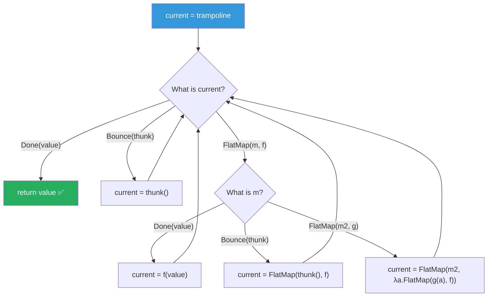

The key insight is that the `while True` loop replaces what would normally be recursive calls. Each iteration peels off one layer of computation. The `FlatMap` cases handle chained computations by reassociating them — this is the monad magic that lets us compose trampolined functions.

---

## Step 6: Trampolining Our Examples

Now let's put the trampoline to work on our earlier examples.

### Last Element of a List (Tail-Recursive)

The simplest conversion — just wrap the tail call in `Bounce`:

```python
def last_element(head: Node | None):
    def _go(node: Node | None) -> Trampoline:
        if node is None:
            return Done(None)
        if node.next is None:
            return Done(node.data)
        return Bounce(lambda node=node: _go(node.next))    # ← bounce instead of recur
    return Trampoline.run(_go(head))

# Test with 100,000 nodes — no stack overflow!
head = Node(1)
current = head
for i in range(2, 100_001):
    current.next = Node(i)
    current = current.next

assert last_element(head) == 100_000  # ✅
```

### Factorial (Accumulator + Trampoline)

```python
def factorial(n: int) -> int:
    def _go(n: int, acc: int) -> Trampoline:
        if n <= 1:
            return Done(acc)
        return Bounce(lambda n=n, acc=acc: _go(n - 1, n * acc))
    return Trampoline.run(_go(n, 1))

assert factorial(5) == 120
assert factorial(10_000)  # Computes without stack overflow! ✅
```

The conversion is mechanical:

| Before | After |
|--------|-------|
| `return value` | `return Done(value)` |
| `return f(args)` (tail call) | `return Bounce(lambda: f(args))` |

That's it for singly-recursive functions. Two-line change.

### Fibonacci (CPS + Trampoline)

For doubly-recursive functions, we combine CPS with the trampoline using `flat_map`:

```python
def fib(n: int) -> int:
    def _go(n: int) -> Trampoline:
        if n <= 1:
            return Done(1)
        return Bounce(lambda n=n: _go(n - 1)).flat_map(    # compute fib(n-1), then...
            lambda f1: Bounce(lambda n=n: _go(n - 2)).flat_map(  # compute fib(n-2), then...
                lambda f2: Done(f1 + f2)))                  # return their sum
    return Trampoline.run(_go(n))

assert fib(10) == 89  # ✅
```

Compare with the original:

```python
# Original (stack-unsafe, doubly recursive)
def fib(n):
    if n <= 1: return 1
    return fib(n - 1) + fib(n - 2)

# Trampolined (stack-safe, same structure!)
def fib(n):
    def _go(n):
        if n <= 1: return Done(1)
        return (Bounce(lambda n=n: _go(n - 1))
            .flat_map(lambda f1:
                Bounce(lambda n=n: _go(n - 2))
            .flat_map(lambda f2:
                Done(f1 + f2))))
    return Trampoline.run(_go(n))
```

The shapes are remarkably similar. The trampolined version is chattier, but the _logic_ is identical.

> **Note**: This trampolined Fibonacci is stack-safe but still exponential in time complexity. To make it _fast_, you'd add memoization — a topic for another post.

---

## Step 7: The Grand Finale — Tree Traversals

Binary tree traversals are the perfect showcase for trampolines. They're:
- **Doubly recursive** (left subtree + right subtree)
- **Beautifully elegant** when written recursively
- **Bug magnets** when written iteratively

Let's define a simple binary tree:

```python
@dataclass
class Tree:
    value: any
    left: Tree | None = None
    right: Tree | None = None
```

### Building a Test Tree

```python
#         1
#        / \
#       2   3
#      / \   \
#     4   5   6
#    /
#   7

tree = Tree(1,
    left=Tree(2,
        left=Tree(4, left=Tree(7)),
        right=Tree(5)),
    right=Tree(3,
        right=Tree(6)))
```

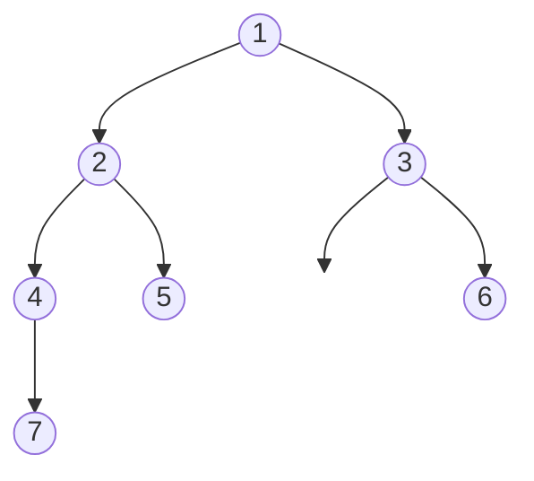

### In-Order Traversal: Recursive vs. Trampolined

**In-order** visits: left subtree → current node → right subtree.

```python
# Recursive (elegant but stack-unsafe)
def inorder(node: Tree | None, acc: list) -> list:
    if node is None:
        return acc
    acc = inorder(node.left, acc)        # visit left
    acc = acc + [node.value]             # visit current
    acc = inorder(node.right, acc)       # visit right
    return acc

assert inorder(tree, []) == [7, 4, 2, 5, 1, 3, 6]
```

Now the trampolined version:

```python
# Trampolined (equally elegant AND stack-safe!)
def inorder(node: Tree | None, acc: list) -> Trampoline:
    if node is None:
        return Done(acc)
    return (
        Bounce(lambda node=node, acc=acc: inorder(node.left, acc))      # visit left
        .flat_map(lambda left_result:
            Done(left_result + [node.value]))                            # visit current
        .flat_map(lambda curr_result:
            Bounce(lambda node=node: inorder(node.right, curr_result)))  # visit right
    )

assert Trampoline.run(inorder(tree, [])) == [7, 4, 2, 5, 1, 3, 6]
```

Let's trace the execution visually:

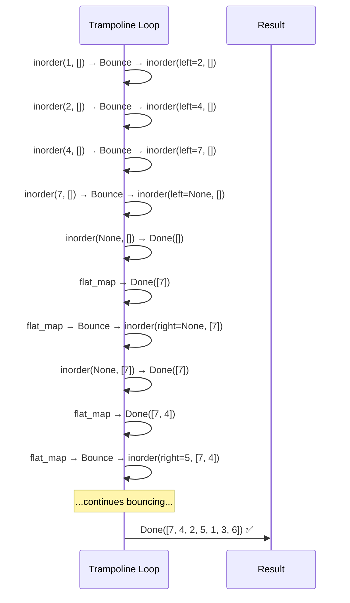

The trampoline loop drives the entire traversal with a call stack of depth **1**. Every step either completes immediately (`Done`) or returns a one-step suspension (`Bounce`) that the loop picks up.

### All Three Traversals

For completeness, here are pre-order and post-order:

```python
def preorder(node: Tree | None, acc: list) -> Trampoline:
    """Pre-order: current → left → right"""
    if node is None:
        return Done(acc)
    return (
        Done(acc + [node.value])                                           # visit current
        .flat_map(lambda curr_result:
            Bounce(lambda node=node: preorder(node.left, curr_result)))    # visit left
        .flat_map(lambda left_result:
            Bounce(lambda node=node: preorder(node.right, left_result)))   # visit right
    )

def postorder(node: Tree | None, acc: list) -> Trampoline:
    """Post-order: left → right → current"""
    if node is None:
        return Done(acc)
    return (
        Bounce(lambda node=node, acc=acc: postorder(node.left, acc))       # visit left
        .flat_map(lambda left_result:
            Bounce(lambda node=node: postorder(node.right, left_result)))  # visit right
        .flat_map(lambda right_result:
            Done(right_result + [node.value]))                             # visit current
    )

assert Trampoline.run(preorder(tree, []))  == [1, 2, 4, 7, 5, 3, 6]
assert Trampoline.run(postorder(tree, [])) == [7, 4, 5, 2, 6, 3, 1]
```

Notice how the three traversals are _structurally identical_ — the only difference is the position of the `Done(acc + [node.value])` line. This makes it trivial to reason about correctness.

Compare that to the iterative versions of these algorithms, which require explicit stacks, flags for visited nodes, and careful state management. The trampoline lets us keep the _simplicity_ of recursion with the _safety_ of iteration.

---

## The Conversion Cheat Sheet

Here's a quick reference for converting recursive functions to trampolined ones:

### Singly Recursive (tail-recursive with accumulator)

| Pattern | Recursive | Trampolined |
|---------|-----------|-------------|
| Base case | `return value` | `return Done(value)` |
| Tail call | `return f(args)` | `return Bounce(lambda: f(args))` |

### Doubly Recursive (CPS with flat_map)

| Pattern | Recursive | Trampolined |
|---------|-----------|-------------|
| Base case | `return value` | `return Done(value)` |
| First recursive call | `a = f(x)` | `Bounce(lambda: f(x)).flat_map(lambda a:` |
| Process result | `b = g(a)` | `Done(g(a)).flat_map(lambda b:` |
| Second recursive call | `return f(y)` | `Bounce(lambda: f(y)))` |

---

## Postscript: What the Grown-Up Languages Do

If you squint at our `Trampoline` class and feel a faint prickling at the back of your neck — like you've seen this shape before — congratulations. You're picking up the scent of a **monad**.

I know, I know. You came here for practical Python, not a category theory lecture. Bear with me for sixty seconds.

Our `Trampoline` has three things:

1. **`Done(value)`** — a way to _wrap_ a value into the trampoline world (mathematicians call this `return`)
2. **`flat_map(f)`** — a way to _chain_ computations (mathematicians call this `bind`)
3. **`Bounce(thunk)`** — a way to describe one step of deferred work (mathematicians call this the _effect_)

That's the whole recipe. Wrap, chain, effect. And anything with these three ingredients forms what functional programmers reverently (or wearily) call a _monad_.

The "grown-up" functional languages — F#, Haskell, Scala — know this, and they _lean into it_. Because once you recognize that your `Trampoline` is a monad, you unlock their built-in syntax sugar for writing monadic code. Remember our tree traversal?

```python
# Python: Trampoline with explicit flat_map chains
def inorder(node, acc):
    if node is None:
        return Done(acc)
    return (
        Bounce(lambda: inorder(node.left, acc))
        .flat_map(lambda left_result:
            Done(left_result + [node.value]))
        .flat_map(lambda curr_result:
            Bounce(lambda: inorder(node.right, curr_result)))
    )
```

In F#, with a [computation expression](https://learn.microsoft.com/en-us/dotnet/fsharp/language-reference/computation-expressions) for trampolines, the same algorithm looks like this:

```fsharp
// F#: Computation expression (the compiler writes the flat_map chains for you)
let rec inorder node acc = trampoline {
    match node with
    | None -> return acc
    | Some n ->
        let! leftResult  = bounce (fun () -> inorder n.Left acc)
        let  currResult  = leftResult @ [n.Value]
        let! rightResult = bounce (fun () -> inorder n.Right currResult)
        return rightResult
}
```

In Haskell, `do`-notation gives you the same trick:

```haskell
-- Haskell: do-notation (same idea, different accent)
inorder Nothing  acc = return acc
inorder (Just n) acc = do
    leftResult  <- bounce $ inorder (left n) acc
    let currResult = leftResult ++ [value n]
    rightResult <- bounce $ inorder (right n) currResult
    return rightResult
```

And in C#, you can abuse LINQ to the same effect:

```csharp
// C#: LINQ query syntax (SelectMany = flat_map)
Trampoline<List<T>> InOrder(Tree<T> node, List<T> acc) =>
    node == null ? Done(acc) :
    from leftResult  in Bounce(() => InOrder(node.Left, acc))
    from currResult  in Done(leftResult.Append(node.Value).ToList())
    from rightResult in Bounce(() => InOrder(node.Right, currResult))
    select rightResult;
```

Notice how all four say _exactly the same thing_ — they just get progressively less noisy about it. The `let!` / `<-` / `from` keywords are all doing `flat_map` under the hood; the language just hides the plumbing so you can focus on the algorithm.

This isn't just syntactic sugar for vanity. Once the language knows your type is a monad, it can:

- **Desugar** sequencing (`let! x = ...`) into the correct chain of `flat_map` calls
- **Verify** that your implementation satisfies the monad laws (left identity, right identity, associativity) — which are exactly the conditions that make the `run` loop terminate and produce correct results
- **Compose** trampolined computations as naturally as you compose functions

So yes: what we built in Python with `Done`, `Bounce`, and `flat_map` is a perfectly respectable monad. We just had to do all the plumbing by hand. In the grown-up functional languages, you declare the monad once and the compiler writes the plumbing for you _forever after_.

If you'd like to explore this rabbit hole further — why the trampoline is actually _the_ Free Monad over thunks, why the monad laws guarantee correctness of `run`, and how to build the F# computation expression yourself — I've written a companion post: [The Trampoline is a Monad (and that's a good thing)](/2026/03/04/the-trampoline-is-a-monad.html).

Just don't say I didn't warn you about the rabbit hole.

---

## Conclusion

We started with a simple observation: recursion is elegant but Python kills it with a bounded call stack. Rather than abandoning recursion, we built up a toolkit:

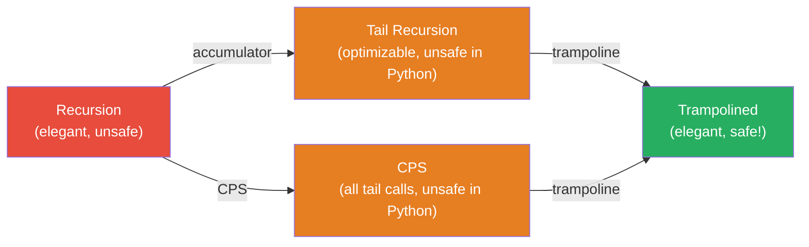

The `Trampoline` class we built is **reusable** — drop it into any Python project and convert your recursive algorithms mechanically. The resulting code:

- **Preserves the structure** of the recursive solution (easy to verify correctness)
- **Uses constant stack space** (won't crash on large inputs)
- **Works in _any_ language** (no TCO required)

The next time someone tells you recursion is dangerous, you can smile, reach for a trampoline, and _bounce_.

---

_The `Trampoline` implementation in this post is based on the seminal paper [Stackless Scala With Free Monads](http://days2012.scala-lang.org/sites/days2012/files/bjarnason_trampolines.pdf) by Rúnar Bjarnason, adapted for Python._

_See also the [original version of this post](/2020/12/07/bouncing-around-with-recursion.html) for F# and C# implementations._
