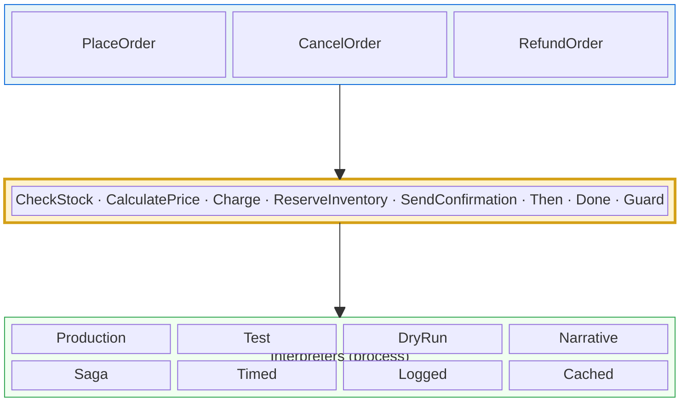

_This series is dedicated to [Christian Smith](https://www.linkedin.com/in/christian-smith-9562658/), with gratitude for all the insightful conversations that shaped the ideas in these posts._

> **Series: Your Clean Architecture Has a Dirty Secret**
>
> This is Part 2 of a 7-part series on separating intent from process in real-world C#.
>
> 1. [Your Clean Architecture Has a Dirty Secret](/2026/03/05/01-your-clean-architecture-has-a-dirty-secret.html)
> 2. **The Algebra of Intent** ← you are here
> 3. [Intent You Can See (and Optimize)](/2026/03/05/03-intent-you-can-see-and-optimize.html)
> 4. [Two Sides of the Same Coin](/2026/03/05/04-two-sides-of-the-same-coin.html)
> 5. [Choosing Both Sides of the Coin](/2026/03/19/choosing-both-sides-of-the-coin.html)
> 6. [Standing on the Shoulders of Giants](/2026/03/05/05-standing-on-the-shoulders-of-giants.html)
> 7. [The Strangler Fig](/2026/03/05/06-the-strangler-fig.html)

---

# The Algebra of Intent

In [Post 1](/2026/03/05/01-your-clean-architecture-has-a-dirty-secret.html), we diagnosed the dirty secret that cuts through every architecture pattern: the *what* and the *how* live in the same code. We couldn't separate them with layers, events, microservices, or vertical slices.

Now let's fix it.

- [The Algebra of Intent](#the-algebra-of-intent)
  - [The Vocabulary We Already Have](#the-vocabulary-we-already-have)
  - [The Problem with Individual Interfaces](#the-problem-with-individual-interfaces)
  - [One Algebra to Rule Them All](#one-algebra-to-rule-them-all)
  - [Writing Programs Against the Algebra](#writing-programs-against-the-algebra)
  - [Multiple Interpreters — the Payoff](#multiple-interpreters--the-payoff)
  - [Testing Without Mocks](#testing-without-mocks)
  - [The Separation Layer](#the-separation-layer)
  - [Why This Approach Shines](#why-this-approach-shines)
    - [1. Zero-cost abstraction](#1-zero-cost-abstraction)
    - [2. Extensibility without breakage](#2-extensibility-without-breakage)
    - [3. Natural composition of interpreters](#3-natural-composition-of-interpreters)
    - [4. Type-safe and exhaustive at compile time](#4-type-safe-and-exhaustive-at-compile-time)
    - [5. Familiar to every C# developer](#5-familiar-to-every-c-developer)
    - [6. Testing without mocks](#6-testing-without-mocks)
  - [What We Can't Do (Yet)](#what-we-cant-do-yet)

---

## The Vocabulary We Already Have

What if we took the *vocabulary* of Post 1 — check stock, calculate price, charge, reserve, notify — and made it explicit? Not as code that *does* those things, but as a *contract* that says what operations exist?

C# developers already do a version of this with dependency injection:

```csharp
public interface IInventoryService { Task<StockResult> CheckStock(List<Item> items); }
public interface IPricingService  { PriceResult Calculate(List<Item> items, Coupon? coupon); }
public interface IPaymentGateway  { Task<ChargeResult> Charge(PaymentMethod method, decimal amount); }
public interface IEmailService    { Task SendConfirmation(Customer customer, PriceResult price); }
```

These are good interfaces. They abstract over individual services. Any `IPaymentGateway` can be Stripe, PayPal, or a test fake. You've been writing this kind of DI for years.

---

## The Problem with Individual Interfaces

Here's the thing those interfaces *don't* capture: how the operations compose.

Look at `PlaceOrder` from Post 1 again:

```csharp
public async Task<OrderResult> PlaceOrder(OrderRequest request)
{
    var stock = await _inventory.CheckStock(request.Items);
    if (!stock.IsAvailable)
        return OrderResult.Failed("Out of stock");

    var price = _pricing.Calculate(request.Items, request.Coupon);

    var charge = await _payment.Charge(request.PaymentMethod, price.Total);
    if (!charge.Succeeded)
        return OrderResult.Failed("Payment failed");

    await _inventory.Reserve(request.Items);
    await _email.SendConfirmation(request.Customer, price);

    return OrderResult.Success(charge.TransactionId);
}
```

The interfaces describe *individual services*. But the orchestration — "check, *then* price, *then* charge, *then* reserve" — is hardcoded in the method body. The *what* is split across four interfaces; the *how they compose* is baked into `PlaceOrder`.

When you swap `IPaymentGateway` for a test double, you're swapping one leaf operation. The orchestration logic — the `if (!stock.IsAvailable)` checks, the sequencing of `await`s, the early returns — those aren't abstracted. They're hardwired. That's where the coupling from Post 1 lives.

What if the *composition itself* was part of the contract?

---

## One Algebra to Rule Them All

Instead of four separate interfaces, define one algebra that captures the **entire vocabulary of the domain** — including how operations chain together:

```csharp
public interface IOrderAlgebra<TResult>
{
    // Domain operations — the vocabulary of intent
    TResult CheckStock(List<Item> items);
    TResult CalculatePrice(List<Item> items, Coupon? coupon);
    TResult ChargePayment(PaymentMethod method, decimal amount);
    TResult ReserveInventory(List<Item> items);
    TResult SendConfirmation(Customer customer, PriceResult price);

    // Composition — how operations chain together
    TResult Then<T>(TResult first, Func<T, TResult> next);
    TResult Done(OrderResult result);
    TResult Guard(TResult value, Func<bool> predicate, string failureReason);
}
```

Notice what happened. The algebra doesn't say *how* to check stock, and it doesn't say *how* to sequence operations. It just says that these operations exist and that they can be chained with `Then`. Both the leaf operations *and* the composition are abstract.

The `TResult` type parameter is the key. It says: "I don't know what type of thing this algebra produces. That depends on the interpreter." A production interpreter might produce `Task<OrderResult>`. A test interpreter might produce `OrderResult` directly. An auditor might produce `List<AuditEntry>`. The algebra doesn't care.

---

## Writing Programs Against the Algebra

Now write `PlaceOrder` as a function that takes an algebra and returns whatever the algebra produces:

```csharp
static TResult PlaceOrder<TResult>(IOrderAlgebra<TResult> alg, OrderRequest request)
{
    return alg.Then<StockResult>(
        alg.CheckStock(request.Items),
        stock => alg.Guard(
            alg.Then<PriceResult>(
                alg.CalculatePrice(request.Items, request.Coupon),
                price => alg.Then<ChargeResult>(
                    alg.ChargePayment(request.PaymentMethod, price.Total),
                    charge => alg.Guard(
                        alg.Then<ReservationResult>(
                            alg.ReserveInventory(request.Items),
                            _ => alg.Then<Unit>(
                                alg.SendConfirmation(request.Customer, price),
                                __ => alg.Done(OrderResult.Success(charge.TransactionId))
                            )
                        ),
                        () => charge.Succeeded,
                        "Payment failed"
                    )
                )
            ),
            () => stock.IsAvailable,
            "Out of stock"
        )
    );
}
```

Ugly? Absolutely. That nesting is brutal. But let's make it readable with a fluent builder:

```csharp
static TResult PlaceOrder<TResult>(IOrderAlgebra<TResult> alg, OrderRequest request) =>
    alg.Pipeline()
       .Do(alg.CheckStock(request.Items))
       .Guard(stock => stock.IsAvailable, "Out of stock")
       .Do(stock => alg.CalculatePrice(request.Items, request.Coupon))
       .Do(price => alg.ChargePayment(request.PaymentMethod, price.Total))
       .Guard(charge => charge.Succeeded, "Payment failed")
       .Do(charge => alg.ReserveInventory(request.Items))
       .Do(_ => alg.SendConfirmation(request.Customer, /* price from earlier step */))
       .Return(charge => OrderResult.Success(charge.TransactionId));
```

Better. But here's the crucial thing: **this function says nothing about how anything happens.** It doesn't `await`. It doesn't decide sync vs. async. It doesn't choose retry policy. It doesn't sequence anything — the `alg` does. It describes intent: validate, price, charge, reserve, notify, done.

The *entire function* is "what." There is no "how" here at all.

---

## Multiple Interpreters — the Payoff

Now the magic. Write different interpreters — different *meanings* for the same program:

```csharp
// Interpreter 1: Production — calls real services, produces Task<OrderResult>
public class ProductionOrder : IOrderAlgebra<Task<OrderResult>>
{
    private readonly IInventoryRepository _inventory;
    private readonly IPricingService _pricing;
    private readonly IPaymentGateway _payment;
    private readonly IEmailService _email;

    public Task<OrderResult> CheckStock(List<Item> items) =>
        _inventory.CheckStockAsync(items).ContinueWith(t => (OrderResult)t.Result);

    public Task<OrderResult> ChargePayment(PaymentMethod method, decimal amount) =>
        _payment.ChargeAsync(method, amount).ContinueWith(t => (OrderResult)t.Result);

    public Task<OrderResult> Then<T>(Task<OrderResult> first, Func<T, Task<OrderResult>> next) =>
        first.ContinueWith(t => next((T)t.Result)).Unwrap();

    // ... etc — each method decides *how* to actually perform the operation
}
```

```csharp
// Interpreter 2: Test — pure, in-memory, deterministic
public class TestOrder : IOrderAlgebra<OrderResult>
{
    private readonly bool _stockAvailable;
    private readonly decimal _price;
    private readonly bool _chargeSucceeds;

    public TestOrder(bool stockAvailable, decimal price, bool chargeSucceeds)
    {
        _stockAvailable = stockAvailable;
        _price = price;
        _chargeSucceeds = chargeSucceeds;
    }

    public OrderResult CheckStock(List<Item> items) =>
        _stockAvailable ? OrderResult.Continue(new StockResult(true))
                        : OrderResult.Failed("Out of stock");

    public OrderResult ChargePayment(PaymentMethod method, decimal amount) =>
        _chargeSucceeds ? OrderResult.Continue(new ChargeResult(true, "test-txn"))
                        : OrderResult.Failed("Payment failed");

    // ... deterministic, no I/O, no external dependencies
}
```

```csharp
// Interpreter 3: Storyteller — produces a human-readable narrative
public class NarrativeOrder : IOrderAlgebra<string>
{
    public string CheckStock(List<Item> items) =>
        $"Check if {items.Count} items are in stock.";

    public string ChargePayment(PaymentMethod method, decimal amount) =>
        $"Charge {amount:C} via {method}.";

    public string Then<T>(string first, Func<T, string> next) =>
        first + "\n" + next(default!);

    public string Done(OrderResult result) =>
        $"Complete order: {result}.";
}
```

```csharp
// Interpreter 4: Dry-run auditor — records what *would* happen
public class DryRunOrder : IOrderAlgebra<List<AuditEntry>>
{
    public List<AuditEntry> CheckStock(List<Item> items) =>
        new() { new AuditEntry("CheckStock", $"{items.Count} items") };

    public List<AuditEntry> ChargePayment(PaymentMethod method, decimal amount) =>
        new() { new AuditEntry("ChargePayment", $"{amount:C} via {method}") };

    public List<AuditEntry> Then<T>(List<AuditEntry> first, Func<T, List<AuditEntry>> next) =>
        first.Concat(next(default!)).ToList();

    // ... records each step without executing it
}
```

Four interpreters. Four completely different behaviors. **The same `PlaceOrder` function drives all of them.**

```csharp
// Production: actually processes the order
var result = await PlaceOrder(new ProductionOrder(services), request);

// Test: deterministic, in-memory
var testResult = PlaceOrder(new TestOrder(stockAvailable: true, price: 99.50m, chargeSucceeds: true), request);

// Narrative: for documentation or debugging
var story = PlaceOrder(new NarrativeOrder(), request);
// "Check if 3 items are in stock.\nCalculate price for 3 items.\nCharge $99.50 via Visa.\n..."

// Dry run: for auditing or compliance review
var plan = PlaceOrder(new DryRunOrder(), request);
// [AuditEntry("CheckStock", "3 items"), AuditEntry("ChargePayment", "$99.50 via Visa"), ...]
```

The `PlaceOrder` function describes *intent*. Each interpreter decides *process*. Same code, four completely different behaviors. The what and the how are finally, genuinely, separated.

---

## Testing Without Mocks

Remember the mock hell from Post 1? Here's the before and after:

```csharp
// BEFORE: Traditional — mock hell (Post 1)
[Test]
public async Task PlaceOrder_ChargesAfterValidation()
{
    var inventory = new Mock<IInventoryRepository>();
    inventory.Setup(i => i.CheckStock(It.IsAny<List<Item>>()))
             .ReturnsAsync(new StockResult(true));

    var pricing = new Mock<IPricingService>();
    pricing.Setup(p => p.Calculate(It.IsAny<List<Item>>(), null))
           .Returns(new PriceResult(99.50m));

    var payment = new Mock<IPaymentGateway>();
    payment.Setup(p => p.Charge(It.IsAny<PaymentMethod>(), 99.50m))
           .ReturnsAsync(new ChargeResult(true, "txn-123"));

    var email = new Mock<IEmailService>();
    // ... 15 lines of setup later, finally the actual test:

    var svc = new OrderService(inventory.Object, pricing.Object,
                               payment.Object, email.Object);

    var result = await svc.PlaceOrder(request);
    Assert.That(result.Succeeded);
    payment.Verify(p => p.Charge(It.IsAny<PaymentMethod>(), 99.50m), Times.Once);
}
// 20 lines of ceremony. 2 lines of intent. More mock than test.
```

```csharp
// AFTER: Tagless Final — swap the interpreter
[Test]
public void PlaceOrder_ChargesAfterValidation()
{
    var result = PlaceOrder(new TestOrder(
        stockAvailable: true,
        price: 99.50m,
        chargeSucceeds: true
    ), request);

    Assert.That(result.Succeeded);
    Assert.AreEqual("test-txn", result.TransactionId);
}
// 6 lines. No mocks. No Moq. No setup/verify ceremony.
```

Six lines. No mocks. No `Setup`. No `Verify`. No `It.IsAny`. The `TestOrder` interpreter isn't a mock — it's a *real implementation* of the algebra. It follows the same contract as `ProductionOrder`. If you add a new operation to the algebra, the compiler *forces* `TestOrder` to implement it — no silent mock drift where your tests keep passing because the mock ignores the new code path.

This is what "testing without mocks" actually looks like. Not "we use fakes instead of mocks" — but the entire mock framework is unnecessary because the architecture doesn't need it.

---

## The Separation Layer

Here's what we've built, drawn as an architecture diagram:



> **Above the line:** pure intent — generic functions that speak only in terms of the algebra. No `await`. No HTTP. No retry. No logging.
>
> **The line itself:** `IOrderAlgebra<TResult>` — the vocabulary of your domain.
>
> **Below the line:** interpreters that decide *how* to run the intent — real I/O, fake, narrative, with retry, with compensation, etc.

Everything *above* the line speaks in terms of intent — `CheckStock`, `ChargePayment`, `Then`. No infrastructure leaks up. Everything *below* the line is an interpreter — pluggable, swappable, composable, testable. The algebra *is* the separation layer.

This pattern has a name: **Tagless Final**.

"Tagless" because there's no runtime tagging or casting — the types enforce correctness at compile time. "Final" because the program is defined by what interpreters can *do* with it — by its *observations* — not by a data structure.

If that sounds abstract, here's the practical version: **it's DI done properly.**

If you've ever programmed against an interface and swapped implementations in tests, you've done a baby version of this. The difference is: we made the *composition* — the sequencing, the error handling, the workflow — part of the algebra too. In traditional DI, the leaf calls (`CheckStock`, `Charge`) are abstract but the orchestration is concrete. In Tagless Final, **the whole program is abstract**. Everything above the line is pure intent. Not just the leaf calls — the sequencing, the branching, the error handling. All of it.

> **Sidebar (F#):** In F#, this entire pattern collapses into a computation expression. What took us a fluent builder and careful generic plumbing in C# becomes:
>
> ```fsharp
> let placeOrder request = order {
>     let! stock = checkStock request.Items
>     do! guard stock.IsAvailable "Out of stock"
>     let! price = calculatePrice request.Items request.Coupon
>     let! charge = chargePayment request.PaymentMethod price.Total
>     do! guard charge.Succeeded "Payment failed"
>     let! _ = reserveInventory request.Items
>     do! sendConfirmation request.Customer price
>     return OrderResult.Success charge.TransactionId
> }
> ```
>
> Night and day in readability. Same concept, less ceremony. If this intrigues you, the [Tagless Final series](/2025/12/12/tagless-final-01-froggy-tree-house.html) explores this in depth with F#.

---

## Why This Approach Shines

Before we move on, let's be explicit about what we've gained — beyond just "separation of concerns":

### 1. Zero-cost abstraction

No intermediate data structure is allocated. The program compiles down to direct method dispatch. In hot paths, this matters. There's no AST, no tree walking, no allocation of node objects. The generic function `PlaceOrder<TResult>` resolves to direct method calls on the interpreter at compile time.

### 2. Extensibility without breakage

Need to add fraud checking to the algebra?

```csharp
public interface IOrderAlgebra<TResult>
{
    // ... existing methods ...
    TResult CheckFraud(Customer customer, decimal amount) => Done(OrderResult.Continue()); // default impl
}
```

Add a method with a default implementation. Existing interpreters don't change. Existing programs don't change. The new operation is available to any program that needs it, and interpreters can override the default as they see fit.

Compare this to adding a case to a discriminated union in a data-based approach — every `switch` statement in every interpreter breaks. We'll see that trade-off in the next post.

### 3. Natural composition of interpreters

Want to log *and* execute? Write a decorator:

```csharp
public class LoggingOrder<TResult> : IOrderAlgebra<TResult>
{
    private readonly IOrderAlgebra<TResult> _inner;
    private readonly ILogger _logger;

    public TResult CheckStock(List<Item> items)
    {
        _logger.LogInformation("CheckStock: {ItemCount} items", items.Count);
        return _inner.CheckStock(items);
    }

    // ... delegate everything, logging before each call
}
```

Want to time every operation? Wrap any interpreter in a `TimingOrder`. Want to add metrics? `MetricsOrder`. These compose freely because they all implement the same interface. Stack them:

```csharp
var interpreter = new LoggingOrder(
                    new TimingOrder(
                      new ProductionOrder(services)));

var result = PlaceOrder(interpreter, request);
// Logged, timed, and executed — without changing PlaceOrder.
```

This is the decorator pattern applied to entire program interpreters, not just individual services.

### 4. Type-safe and exhaustive at compile time

If your interpreter doesn't handle an operation, it doesn't compile. No runtime "I forgot to handle this case" surprises. The compiler is your safety net.

### 5. Familiar to every C# developer

This is interfaces and DI. Your team already knows the mechanics. The conceptual leap is *what you put behind the interface* — not the pattern itself. You're not introducing exotic language features or unfamiliar libraries. It's interfaces all the way down.

### 6. Testing without mocks

The test interpreter isn't a mock — it's a *real implementation* of the algebra that happens to be deterministic and in-memory. No Moq setup. No verify calls. No mock drift. Just pass the test interpreter and assert the result.

---

## What We Can't Do (Yet)

This is powerful. We've completely separated intent from process. We can test, audit, document, and run our order flow with different interpreters. The what and the how live in different files, different classes, different *concepts*.

But there's one thing we *can't* do: we can't **look inside** the program.

`PlaceOrder` is a function. It takes an algebra and produces a result. You can call it, but you can't *see its steps*. You can't walk the sequence and say "there are 5 operations, 2 of which hit the database." You can't reorder steps, batch them, or optimize them. The program is opaque — already "compiled" into a function that drives the interpreter.

Imagine the boss walks in: *"We're spending too much on payment gateway calls. Can we batch orders that come in within a 100ms window and do a single bulk charge?"*

With our current approach, you'd need to write a custom batching interpreter that somehow accumulates calls — but the sequencing is baked into the function's control flow. You can't reorder steps you can't see.

Or: *"Show me the execution plan for this order before we run it — like SQL EXPLAIN."*

How? The program is a function. By the time you can observe it, it's already running.

What if the program wasn't a function? What if it was *data*?

That's the next post.

> **Sidebar (Haskell):** In Haskell, this entire pattern is just a type class. No `IKind<TBrand,T>` wrappers, no `Eval` boxing, no ceremony:
>
> ```haskell
> class Monad m => OrderAlgebra m where
>   checkStock       :: [Item] -> m StockResult
>   calculatePrice   :: [Item] -> Maybe Coupon -> m PriceResult
>   chargePayment    :: PaymentMethod -> Double -> m ChargeResult
>   reserveInventory :: [Item] -> m ReservationResult
>   sendConfirmation :: Customer -> PriceResult -> m ()
>   orderFailed      :: Text -> m a
>
> placeOrder :: OrderAlgebra m => OrderRequest -> m OrderResult
> placeOrder req = do
>   stock <- checkStock (orderItems req)
>   when (not $ stockIsAvailable stock) $ orderFailed "Out of stock"
>   price <- calculatePrice (orderItems req) (orderCoupon req)
>   charge <- chargePayment (orderPaymentMethod req) (priceTotal price)
>   when (not $ chargeSucceeded charge) $ orderFailed "Payment failed"
>   _ <- reserveInventory (orderItems req)
>   sendConfirmation (orderCustomer req) price
>   pure $ OrderSuccess (chargeTransactionId charge)
> ```
>
> The `m` *is* the interpreter. `IO` for production, `Either Text` for tests, `Writer [Text]` for narrative. The HKT problem that C# needs brands and wrappers to solve? Haskell's kind system handles it natively: `m` has kind `* -> *`. See the [Haskell companion code](https://github.com/johnazariah/johnazariah.github.io/tree/main/code/intent-vs-process/haskell/) for the complete implementation.

---

> **Companion code**: The full working implementation — including all four interpreters and the test suite — is in the [companion repository](https://github.com/johnazariah/johnazariah.github.io/tree/main/code/intent-vs-process/). Available in [C#](https://github.com/johnazariah/johnazariah.github.io/tree/main/code/intent-vs-process/csharp/), [F#](https://github.com/johnazariah/johnazariah.github.io/tree/main/code/intent-vs-process/fsharp/), and [Haskell](https://github.com/johnazariah/johnazariah.github.io/tree/main/code/intent-vs-process/haskell/). The blog code is simplified for pedagogy; the companion code compiles and passes all tests.

---

> **Next**: [Intent You Can See (and Optimize)](/2026/03/05/03-intent-you-can-see-and-optimize.html) — where we make programs inspectable and discover that programs-as-data unlock batching, deduplication, cost estimation, and a saga pattern that writes itself.

---

*This is Part 2 of the series **"Your Clean Architecture Has a Dirty Secret."** The [full series](/tags/software-architecture/) explores separating intent from process using techniques from functional programming — Tagless Final, Free Monads, and the mathematical foundations that make them trustworthy.*
