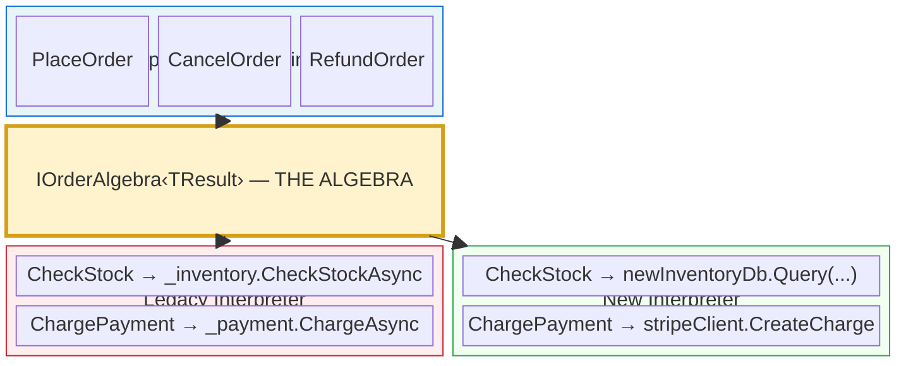
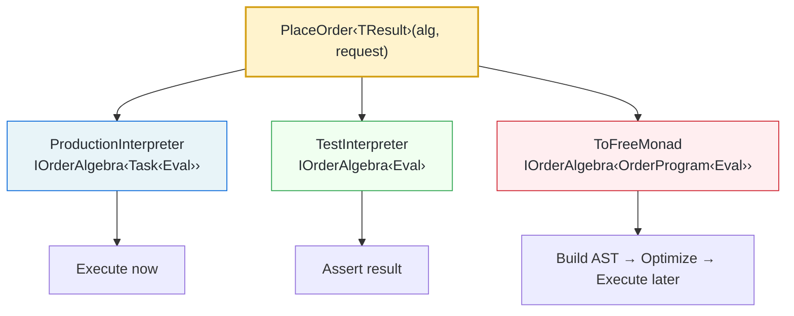
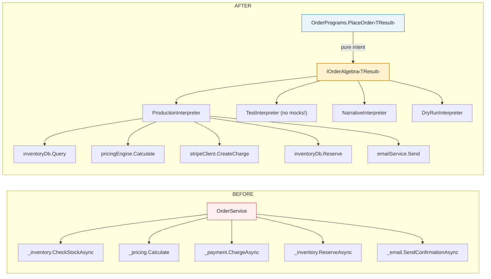

_This series is dedicated to [Christian Smith](https://www.linkedin.com/in/christian-smith-9562658/), with gratitude for all the insightful conversations that shaped the ideas in these posts._

> **Series: Your Clean Architecture Has a Dirty Secret**
>
> This is Part 7 of a 7-part series on separating intent from process in real-world C#.
>
> 1. [Your Clean Architecture Has a Dirty Secret](/2026/03/05/01-your-clean-architecture-has-a-dirty-secret.html)
> 2. [The Algebra of Intent](/2026/03/05/02-the-algebra-of-intent.html)
> 3. [Intent You Can See (and Optimize)](/2026/03/05/03-intent-you-can-see-and-optimize.html)
> 4. [Two Sides of the Same Coin](/2026/03/05/04-two-sides-of-the-same-coin.html)
> 5. [Choosing Both](/2026/03/19/intent-vs-process-choosing-both.html)
> 6. [Standing on the Shoulders of Giants](/2026/03/05/05-standing-on-the-shoulders-of-giants.html)
> 7. **The Strangler Fig** ← you are here

---

# The Strangler Fig

_"This is all very cool, but I have 200,000 lines of n-tier code. What do I do on Monday morning?"_

That's the question this post answers.

Posts 1–5 diagnosed the coupling (intent fused with process), built two solutions (Tagless Final and Free Monad), proved they're mathematically dual, and showed the foundations that make them trustworthy. If you stopped there, you'd have a powerful set of ideas — and no way to use them in your existing codebase.

This post is the bridge. No rewrites. No "start from scratch." Just a systematic, incremental migration that works with your existing code, your existing tests, and your existing team.

- [The Strangler Fig Pattern](#the-strangler-fig-pattern)
- [Step 1: Define the Algebra](#step-1-define-the-algebra)
- [Step 2: Write the Legacy Interpreter](#step-2-write-the-legacy-interpreter)
- [Step 3: Write the Program](#step-3-write-the-program)
- [Step 4: Write the Test Interpreter](#step-4-write-the-test-interpreter)
- [Step 5: Strangle One Service at a Time](#step-5-strangle-one-service-at-a-time)
- [Step 6: Cross-Cutting Concerns Migrate for Free](#step-6-cross-cutting-concerns-migrate-for-free)
- [Step 7: The Bridge — Tagless Final Generates Free Monad](#step-7-the-bridge--tagless-final-generates-free-monad)
- [Step 8: Shadow Traffic and Canary Deploys](#step-8-shadow-traffic-and-canary-deploys)
- [The Migration Boundary](#the-migration-boundary)
- [What Changes and What Doesn't](#what-changes-and-what-doesnt)
- [FAQ: Objections from the Team](#faq-objections-from-the-team)

---

## The Strangler Fig Pattern

Martin Fowler named this pattern after a species of fig tree that grows around its host, gradually replacing it while the host continues to function. The analogy is perfect: your legacy code keeps running while you grow the new structure around it.

The key insight: **the algebra IS the migration boundary.** Everything above the line is migrated. Everything below is being strangled. You can measure progress by counting how many interpreter methods still delegate to legacy code.



---

## Step 1: Define the Algebra

Start from the existing `OrderService.PlaceOrder` method — the one from Post 1 that fuses intent with process. Read it and extract the vocabulary:

```csharp
// What operations does PlaceOrder actually perform?
// 1. CheckStock      → StockResult
// 2. CalculatePrice  → PriceResult
// 3. ChargePayment   → ChargeResult
// 4. ReserveInventory → ReservationResult
// 5. SendConfirmation → Unit

public interface IOrderAlgebra<TResult>
{
    TResult CheckStock(List<Item> items);
    TResult CalculatePrice(List<Item> items, Coupon? coupon);
    TResult ChargePayment(PaymentMethod method, decimal amount);
    TResult ReserveInventory(List<Item> items);
    TResult SendConfirmation(Customer customer, PriceResult price);

    TResult Then<T>(TResult first, Func<T, TResult> next);
    TResult Done(OrderResult result);
    TResult Guard(Func<bool> predicate, Func<TResult> onSuccess, string failureReason);
}
```

This algebra is extracted *directly* from your existing code. You're not designing something new — you're naming what's already there.

**Time: 30 minutes.** Read the method, list the operations, write the interface.

---

## Step 2: Write the Legacy Interpreter

This is the crucial step that makes migration safe. **Wrap your existing services behind the algebra:**

```csharp
public class LegacyOrderInterpreter : IOrderAlgebra<Task<Eval>>
{
    // These are the SAME dependencies your OrderService already uses.
    private readonly IInventoryService _inventory;
    private readonly IPricingService _pricing;
    private readonly IPaymentGateway _payment;
    private readonly IEmailService _email;

    public LegacyOrderInterpreter(
        IInventoryService inventory,
        IPricingService pricing,
        IPaymentGateway payment,
        IEmailService email)
    {
        _inventory = inventory;
        _pricing = pricing;
        _payment = payment;
        _email = email;
    }

    public async Task<Eval> CheckStock(List<Item> items)
    {
        // Delegates to the EXACT same service your OrderService calls
        var result = await _inventory.CheckStockAsync(items);
        return Eval.Of(result);
    }

    public async Task<Eval> ChargePayment(PaymentMethod method, decimal amount)
    {
        var result = await _payment.ChargeAsync(method, amount);
        return Eval.Of(result);
    }

    // ... every method delegates to the existing service
}
```

Notice: **no behavior changed.** The legacy interpreter calls the same services, in the same way, with the same arguments. It's a *wrapper*, not a replacement. Your existing services, with all their quirks and battle-tested edge cases, are still doing the actual work.

**Time: 1–2 hours.** Mechanical wrapping — one method per service call.

---

## Step 3: Write the Program

Now write `PlaceOrder` against the algebra, matching the behavior of your existing method:

```csharp
public static class OrderPrograms
{
    public static TResult PlaceOrder<TResult>(
        IOrderAlgebra<TResult> alg, OrderRequest request) =>
        alg.Then<StockResult>(
            alg.CheckStock(request.Items),
            stock => alg.Guard(
                () => stock.IsAvailable,
                () => alg.Then<PriceResult>(
                    alg.CalculatePrice(request.Items, request.Coupon),
                    // ... same five steps, same sequencing
                ),
                "Out of stock"
            )
        );
}
```

**The critical test:** Run both the old `OrderService.PlaceOrder` and the new `OrderPrograms.PlaceOrder(new LegacyOrderInterpreter(...), request)` against the same inputs. They should produce identical results. If they don't, your program doesn't match the legacy behavior — fix it before proceeding.

```csharp
[Fact]
public async Task NewProgram_MatchesLegacyBehavior()
{
    var request = CreateTestRequest();

    // Old way
    var legacyResult = await _legacyOrderService.PlaceOrder(request);

    // New way — same services, wrapped in the algebra
    var interpreter = new LegacyOrderInterpreter(
        _inventory, _pricing, _payment, _email);
    var newResult = await OrderPrograms.PlaceOrder(interpreter, request);

    Assert.Equal(legacyResult, newResult.Unwrap<OrderResult>());
}
```

**Time: 1–2 hours.** Translating the method body into algebra calls.

---

## Step 4: Write the Test Interpreter

Now comes the payoff. Write a test interpreter — no mocks, no Moq, no service fakes:

```csharp
[Fact]
public void PlaceOrder_HappyPath()
{
    var result = OrderPrograms.PlaceOrder(
        new TestInterpreter(
            stockAvailable: true,
            price: 99.50m,
            chargeSucceeds: true),
        request);

    Assert.True(result.IsSuccess);
}
```

Your existing mock-heavy tests still work. They test the old `OrderService`. But new tests are written against the algebra — clean, fast, zero infrastructure. **Both test suites run in CI.** When they agree, you know the migration is correct.

**Time: 30 minutes.** The test interpreter is trivial to write.

---

## Step 5: Strangle One Service at a Time

Now the incremental migration begins. Pick one service — say, you're replacing the old `IInventoryService` with a new inventory system:

```csharp
public class HybridOrderInterpreter : IOrderAlgebra<Task<Eval>>
{
    private readonly NewInventoryClient _newInventory;  // ← NEW
    private readonly IPricingService _pricing;           // ← still legacy
    private readonly IPaymentGateway _payment;           // ← still legacy
    private readonly IEmailService _email;               // ← still legacy

    public async Task<Eval> CheckStock(List<Item> items)
    {
        // NEW implementation — talks to the new inventory system
        var result = await _newInventory.QueryAvailability(items);
        return Eval.Of(new StockResult(result.AllAvailable));
    }

    public async Task<Eval> ChargePayment(PaymentMethod method, decimal amount)
    {
        // LEGACY — still uses the old payment gateway
        var result = await _payment.ChargeAsync(method, amount);
        return Eval.Of(result);
    }

    // ...
}
```

**The program didn't change.** `OrderPrograms.PlaceOrder` is the same generic function. It doesn't know or care that `CheckStock` now talks to a different database. The algebra shields the business logic from the infrastructure change.

Deploy this. Run both interpreters (legacy and hybrid) against production traffic. Compare results. When they match, switch over. One service strangled.

**Progress metric:** "4 of 5 operations still delegate to legacy code" → "3 of 5" → "2 of 5" → ...

---

## Step 6: Cross-Cutting Concerns Migrate for Free

Here's where the algebra really earns its keep during migration. With the old `OrderService`, you have logging, retry, and metrics baked into the method body — or scattered across service implementations. With the algebra, they're *decorators*:

```csharp
public class LoggingInterpreter<TResult> : IOrderAlgebra<TResult>
{
    private readonly IOrderAlgebra<TResult> _inner;
    private readonly ILogger _logger;

    public TResult CheckStock(List<Item> items)
    {
        _logger.LogInformation("CheckStock: {Count} items", items.Count);
        var result = _inner.CheckStock(items);
        _logger.LogInformation("CheckStock complete");
        return result;
    }
    // ... every method logs and delegates
}

// Stack them:
var interpreter = new LoggingInterpreter(
                    new TimingInterpreter(
                      new RetryInterpreter(
                        new HybridOrderInterpreter(...))));
```

This logging works for **both** legacy and new implementations — because they all implement the same algebra. You don't add logging in two places. You don't worry about the legacy service forgetting to log. The decorator handles it for everything that passes through the algebra.

---

## Step 7: The Bridge — Tagless Final Generates Free Monad

This is the key architectural move for the long term — and it's the reason we covered both encodings in Posts 2–4.

Start with Tagless Final. It's the natural on-ramp: interfaces and DI, zero ceremony, your team already knows the mechanics. Write all your programs against `IOrderAlgebra<TResult>`. Ship it. Live with it. Get comfortable.

Then, when the boss walks in and says *"can we batch those payment calls?"* or *"show me the execution plan before we run it"* — you don't rewrite. You write **one more interpreter**: the one that produces a Free Monad AST.

```csharp
/// An interpreter that doesn't execute anything.
/// Instead, it builds a Free Monad program — a data structure
/// you can walk, analyze, optimize, and THEN execute.
public class ToFreeMonad : IOrderAlgebra<OrderProgram<Eval>>
{
    public OrderProgram<Eval> CheckStock(List<Item> items) =>
        OrderProgramExtensions.Lift(new Free.CheckStock(items))
            .Select(result => Eval.Of(result));

    public OrderProgram<Eval> CalculatePrice(List<Item> items, Coupon? coupon) =>
        OrderProgramExtensions.Lift(new Free.CalculatePrice(items, coupon))
            .Select(result => Eval.Of(result));

    public OrderProgram<Eval> ChargePayment(PaymentMethod method, decimal amount) =>
        OrderProgramExtensions.Lift(new Free.ChargePayment(method, amount))
            .Select(result => Eval.Of(result));

    // ... each method lifts a step into the Free Monad AST

    public OrderProgram<Eval> Then<T>(
        OrderProgram<Eval> first, Func<T, OrderProgram<Eval>> next) =>
        first.SelectMany(eval => next(eval.Unwrap<T>()));

    public OrderProgram<Eval> Done(OrderResult result) =>
        new Done<Eval>(Eval.Of(result));

    public OrderProgram<Eval> Guard(
        Func<bool> predicate, Func<OrderProgram<Eval>> onSuccess, string failureReason) =>
        predicate() ? onSuccess() : new Failed<Eval>(failureReason);
}
```

Now look at what you can do with the *same* `PlaceOrder` program:

```csharp
// Day-to-day: Tagless Final — direct execution, zero overhead
var result = await OrderPrograms.PlaceOrder(
    new ProductionInterpreter(services), request);

// Testing: Tagless Final — swap interpreter, no mocks
var testResult = OrderPrograms.PlaceOrder(
    new TestInterpreter(stockAvailable: true, price: 99.50m, chargeSucceeds: true),
    request);

// Optimization: SAME program → Free Monad AST → optimize → execute
var program = OrderPrograms.PlaceOrder(new ToFreeMonad(), request);

// Now you have data. Walk it.
var plan = Optimizers.Analyze(program);
Console.WriteLine(plan);
// "2 DB calls, 1 payment API call, 1 email. Est. latency: 1010ms. Est. cost: $0.031"

// Batch multiple programs before running them
var programs = batch.Select(req => OrderPrograms.PlaceOrder(new ToFreeMonad(), req));
var optimized = Optimizers.BatchPayments(programs);

// Run the optimized programs
foreach (var prog in optimized)
    await OrderInterpreter.RunAsync(prog, productionExecutor);
```

**The crucial insight: `OrderPrograms.PlaceOrder` never changed.** It's the same generic function you wrote in Step 3. It doesn't know whether it's driving a production interpreter, a test interpreter, or building an AST. The `ToFreeMonad` interpreter is just another implementation of `IOrderAlgebra<TResult>` — one whose "result" happens to be a data structure instead of a side effect.

This is the duality from Post 4 in action:



This is why we taught both encodings. Tagless Final is your *daily driver* — clean, fast, extensible. The Free Monad is your *optimization pipeline* — reachable through a single interpreter, without changing a line of business logic.

### The Migration Timeline

| Phase | What you use | Why |
|-------|-------------|-----|
| **Week 1** | Tagless Final only | Separate intent from process. Delete mock hell. Ship it. |
| **Months 1–6** | Tagless Final + legacy strangling | Replace services one at a time. Decorator-based logging/retry. |
| **When needed** | Add `ToFreeMonad` interpreter | Boss wants execution plans, batching, or cost analysis. |
| **Later** | Free Monad optimizers | Batch payments, deduplicate stock checks, minimize LLM calls. |

You don't need the Free Monad on day one. You don't even need it on day 100. But when you need it, it's *one interpreter away* — not a rewrite.

---

## Step 8: Shadow Traffic and Canary Deploys

With the `ToFreeMonad` bridge in place, shadow traffic becomes trivial.

Want to validate that the new inventory system gives the same answers as the old one, *in production*, with *real traffic*, without affecting users?

```csharp
// Build the program as data via the ToFreeMonad interpreter
var program = OrderPrograms.PlaceOrder(new ToFreeMonad(), request);

// Run it through the LEGACY executor (this is what the user sees)
var legacyResult = await OrderInterpreter.RunAsync(program, legacyExecutor);

// Run the SAME program through the NEW executor (shadow — fire and forget)
_ = Task.Run(async () =>
{
    var newResult = await OrderInterpreter.RunAsync(program, newExecutor);
    if (!AreEquivalent(legacyResult, newResult))
        _alertService.Flag("Shadow mismatch", request, legacyResult, newResult);
});

return legacyResult; // user always gets the legacy result
```

The program is *data* — you can run it twice with different executors. With the traditional `OrderService.PlaceOrder`, you'd need to duplicate the entire method or add invasive branching logic. With the algebra, you build the program once and interpret it as many times as you like.

This is also how you do **canary deploys** for business logic changes. Write a new version of `PlaceOrder` (say, one that adds a fraud check step). Run both the old and new programs against real traffic. Compare results. Roll forward when they converge.

---

## The Migration Boundary

After all services are strangled, delete the legacy interpreter. What remains:



The `OrderService` class is gone. The business logic lives in `OrderPrograms` — pure, testable, infrastructure-free. The infrastructure lives in interpreters — pluggable, composable, independently deployable.

---

## What Changes and What Doesn't

| What changes | What doesn't |
|---|---|
| Where the business logic lives (method body → generic function) | What the business logic says (same five steps) |
| How tests work (mocks → interpreter swap) | What tests verify (same assertions) |
| How services are called (direct → through algebra) | What services do (same implementations, initially) |
| How cross-cutting concerns are added (invasion → decoration) | What concerns exist (logging, retry, metrics) |
| How you reason about the code (method ↔ infrastructure) | What the code does for the user (same behavior) |

The user sees no difference. The CI pipeline sees no difference. The monitoring dashboards see no difference. The only difference is in your ability to change the code safely.

---

## FAQ: Objections from the Team

### "This adds a layer of indirection."

Yes. So does every interface you already use. The question isn't "is there indirection?" — it's "does the indirection pay for itself?" When your test suite drops from 2000 lines of mock setup to 200 lines of interpreter tests, it pays for itself. When you can swap a payment provider without touching business logic, it pays for itself. When a new team member can read `PlaceOrder` and understand the business flow without wading through async/retry/logging noise, it pays for itself.

### "My team doesn't know what a 'Free Monad' is."

They don't need to. The Tagless Final encoding (Post 2) is interfaces and DI — your team already knows the mechanics. Start there. The Free Monad (Post 3) is for when you need optimization or structural testing — and by that point, the team will have lived with the algebra long enough to understand why programs-as-data are useful.

### "We don't have time for a rewrite."

Good — because this isn't a rewrite. Step 2 (the legacy interpreter) takes an afternoon. You're not changing behavior, you're wrapping it. The existing `OrderService` keeps running in production while you build the algebra alongside it. The strangler fig grows around the host.

### "What about performance?"

The Tagless Final encoding has zero overhead — it compiles to direct method dispatch (Post 2). The Free Monad allocates AST nodes, but only when you need structural analysis or optimization (Post 3). For most code paths, the Tagless Final encoding is all you need, and it's as fast as the original code.

### "We have 50 services. Do we need 50 algebras?"

No. Start with the one service that changes most often or has the worst test coverage. Define its algebra. Migrate it. Learn. Then decide whether the next service is worth doing. The pattern is fractal — each service can have its own algebra, or related services can share one. Start small.

### "What if we get halfway and abandon it?"

You're fine. The legacy interpreter still works. The old `OrderService` still works. You haven't deleted anything — you've added an algebra and an interpreter that wraps the existing code. The worst case is: you have some extra interfaces that you stop using. There's no point of no return.

---

That's the Monday morning plan:

1. Read your most complex method. List its operations. Write the algebra. *(30 min)*
2. Wrap your existing services in a legacy interpreter. *(1–2 hours)*
3. Write the program against the algebra. *(1–2 hours)*
4. Verify it matches the legacy behavior. *(30 min)*
5. Write a test interpreter. Delete some mocks. *(30 min)*
6. Start strangling, one service at a time.
7. When you need optimization: add `ToFreeMonad` — one interpreter, not a rewrite.
8. Shadow traffic, canary deploys, execution plans — all for free.

The theory was in Posts 1–5. The practice starts here.

---

> **Companion code**: The full working implementation — including the traditional OrderService, Tagless Final algebra with four interpreters, Free Monad with structural analysis and saga support — is in the [companion repository](https://github.com/johnazariah/johnazariah.github.io/tree/main/code/intent-vs-process/). Available in [C#](https://github.com/johnazariah/johnazariah.github.io/tree/main/code/intent-vs-process/csharp/) (57 tests), [F#](https://github.com/johnazariah/johnazariah.github.io/tree/main/code/intent-vs-process/fsharp/) (27 tests), and [Haskell](https://github.com/johnazariah/johnazariah.github.io/tree/main/code/intent-vs-process/haskell/) (29 tests).

---

*This is Part 7 of the series **"Your Clean Architecture Has a Dirty Secret."** The full series:*

1. *[Your Clean Architecture Has a Dirty Secret](/2026/03/05/01-your-clean-architecture-has-a-dirty-secret.html) — the diagnosis*
2. *[The Algebra of Intent](/2026/03/05/02-the-algebra-of-intent.html) — Tagless Final*
3. *[Intent You Can See (and Optimize)](/2026/03/05/03-intent-you-can-see-and-optimize.html) — Free Monads*
4. *[Two Sides of the Same Coin](/2026/03/05/04-two-sides-of-the-same-coin.html) — the duality*
5. *[Choosing Both](/2026/03/19/intent-vs-process-choosing-both.html) — parallelism*
6. *[Standing on the Shoulders of Giants](/2026/03/05/05-standing-on-the-shoulders-of-giants.html) — the foundations*
7. *[The Strangler Fig](/2026/03/05/06-the-strangler-fig.html) — the migration*

*For the F# perspective on Tagless Final, see the [six-part Tagless Final series](/2025/12/12/tagless-final-01-froggy-tree-house.html). For the Free Monad story that started it all, see [Bouncing around with Recursion](/2020/12/07/bouncing-around-with-recursion.html) and [The Trampoline is a Monad](/2026/03/04/the-trampoline-is-a-monad.html).*
