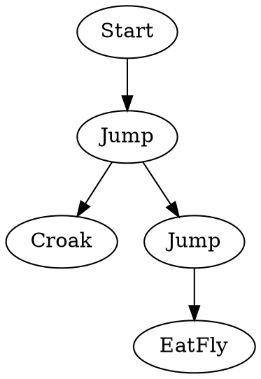

# Maps, Branches, and Choices: Nondeterminism Arrives

[<< Previous: Froggy Tree House](./01-froggy-tree-house.md)

Welcome back! In the last post, we built a tiny DSL to control Froggy. But there was a problem: Froggy was a robot. He followed a strict, linear script.

```fsharp
frog {
    jump
    croak
    eat_fly
}
```

Real trees aren't linear. They branch. Sometimes Froggy has to make a choice: should he jump to the left branch or the right branch? Should he eat the fly or save it for later?

Today, we're going to introduce **Nondeterminism**.

## The Fork in the Road

We want to be able to write something like this:

```fsharp
let exploration = frog {
    jump
    choose [
        frog { croak }
        frog { jump; eat_fly }
    ]
}
```

Here, `choose` means "do any of these things". It splits the timeline. In one future, Froggy croaks. In another, he jumps and eats.

## Updating the Interpreter Definition

To support this, we need to add `Choose` to our interpreter record.

```fsharp
type FrogInterpreter<'a> = {
    Jump : unit -> 'a
    Croak : unit -> 'a
    EatFly : unit -> 'a
    // The new power!
    Choose : 'a list -> 'a
    
    Bind : 'a -> (unit -> 'a) -> 'a 
    Return : unit -> 'a
}
```

And we update our builder to support a `choose` custom operation (or just a helper function).

```fsharp
// Helper for the DSL
let choose options = fun (i: FrogInterpreter<'a>) -> 
    let interpretedOptions = options |> List.map (fun opt -> opt i)
    i.Choose interpretedOptions
```

## Interpreter 3: The Multiverse Simulator

Remember our `simulator` from last time? It returned a `FrogState -> FrogState`.
If we want to support choice, we can't return just *one* state anymore. We need to return *all possible* states.

So our new return type is `FrogState -> list<FrogState>`.

```fsharp
let multiverseSimulator : FrogInterpreter<FrogState -> list<FrogState>> = {
    // Basic actions now return a list of one result
    Jump = fun () -> fun s -> [ { s with Height = s.Height + 1 } ]
    Croak = fun () -> fun s -> [ s ] 
    EatFly = fun () -> fun s -> [ { s with Hunger = 0 } ]
    
    Return = fun () -> fun s -> [ s ]
    
    // Bind is tricky! We have to apply 'next' to ALL results from 'prev'
    Bind = fun prev next -> fun s -> 
        let possibleStates = prev s
        // For every possible state we ended up in...
        possibleStates |> List.collect (fun s' -> 
            // ...run the next step of the program
            let nextAction = next()
            nextAction s'
        )

    // Choose just concatenates the possibilities
    Choose = fun options -> fun s -> 
        options |> List.collect (fun opt -> opt s)
}
```

Now if we run `exploration` with this interpreter, we get a list of all possible outcomes!

## Interpreter 4: The Cartographer (Graph Builder)

Simulating states is cool, but it's hard to visualize. What if we want to draw a map of all possible paths Froggy can take?

We can build a **Graph Interpreter**. This interpreter will produce a list of Nodes and Edges, suitable for a tool like GraphViz (DOT format).

Let's say our result type is a `Graph`.

```fsharp
type NodeId = int
type Edge = { From: NodeId; To: NodeId; Label: string }
type Graph = { Nodes: NodeId list; Edges: Edge list; CurrentTip: NodeId }

// Helper to merge graphs
let merge g1 g2 = 
    { Nodes = g1.Nodes @ g2.Nodes |> List.distinct
      Edges = g1.Edges @ g2.Edges |> List.distinct
      CurrentTip = g2.CurrentTip } // Tip moves forward
```

This interpreter is a bit trickier because we need to generate unique IDs for nodes. In a real implementation, we might use a `State` monad to track the "next available ID".

For now, let's imagine our interpreter returns a function `NodeId -> Graph`. You give it the ID of the node you are currently at, and it returns the graph of what happens *after*.

```fsharp
let graphBuilder : FrogInterpreter<NodeId -> Graph> = {
    Jump = fun () -> fun currentId -> 
        let nextId = currentId + 1 // Simplified ID generation
        { Nodes = [currentId; nextId]
          Edges = [{ From = currentId; To = nextId; Label = "Jump" }]
          CurrentTip = nextId }

    // ... Croak and EatFly are similar ...

    Bind = fun prev next -> fun startId ->
        let g1 = prev startId
        let g2 = next() g1.CurrentTip
        merge g1 g2
        
    Choose = fun options -> fun startId ->
        // This is the cool part!
        // We run ALL options starting from the SAME startId
        let graphs = options |> List.map (fun opt -> opt startId)
        
        // And we merge them all together
        graphs |> List.reduce merge
}
```

When `Choose` happens in the Graph Interpreter, it branches the graph. The `prev` node connects to *multiple* next nodes.

By running the *exact same code* (`exploration`) through this new interpreter, we get a visual map of the game's logic.



We can render this!


## Reachability Analysis

Now that we have a graph, we can answer questions that the Simulator couldn't easily answer.

**"Is it possible to reach Node 4?"**

With the simulator, we'd have to check every result in the list. With the graph, we can run a standard BFS or DFS algorithm.

**"Is there a cycle? Can Froggy get stuck in a loop?"**

If we add a `GoBack` instruction, our graph might have edges pointing backwards. A simple cycle detection algorithm on the `Graph` data structure tells us immediately.

This is the power of **Static Analysis**. We aren't running the code; we are analyzing its structure.

> **Sidebar: Choice Creates Multiple Futures**
>
> This is the key insight for today: **Nondeterminism isn't random.**
>
> When we say `choose`, we aren't rolling a dice and picking one. We are exploring *all* of them simultaneously.
>
> - The **Simulator** explores them to find all possible end states.
> - The **Graph Builder** explores them to draw the territory.
>
> If you've heard of the **List Monad**, this is it. The `Bind` function we wrote using `List.collect` is exactly how the List Monad works. It takes a value, and a function that produces a list of values, and flattens the result.

This is starting to sound a bit like... searching? Or verifying?

## What's Next?

We have a map. We have choices. But right now, all choices are equal. In the next post, we'll add **Goals** (winning) and **Threats** (losing). We'll see how to use our interpreters to tell us if Froggy *can* win, or if he *must* lose.

---
[<< Previous: Froggy Tree House](./01-froggy-tree-house.md) | [Next: Goals, Threats, and Getting Stuck >>](./03-goals-threats.md)
